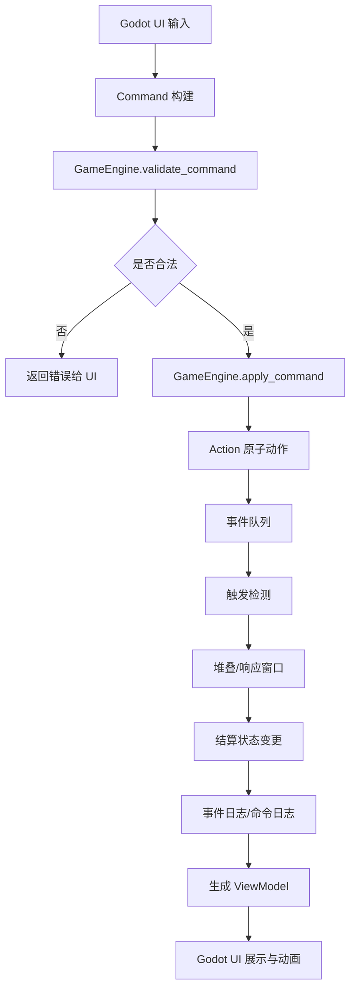

# 01 规则引擎设计

规则引擎是项目最重要的底层模块。它负责判断操作是否合法、推进阶段、结算卡牌效果、维护游戏状态、生成日志，并为 UI 提供可展示的状态快照。规则引擎不关心动画、鼠标、按钮、镜头、音效。

## 设计目标

1. 支持完整桌面对战流程。
2. 支持复杂时点：主动、触发、反应、持续、规则效果。
3. 支持堆叠响应与后发先至。
4. 支持天灾值、天灾牌、天灾效果和最终天灾。
5. 支持前后排战场、士气、消耗区、圣物区、主宰区、墓地、牌库。
6. 支持卡牌脚本增量实现。
7. 支持确定性回放、测试和调试。
8. 为未来联机、AI、构筑器保留接口。

## 引擎边界

规则引擎负责：

- 游戏初始化。
- 洗牌和抽牌。
- 回合阶段推进。
- 合法行动查询。
- 命令执行。
- 费用支付。
- 卡牌移动。
- 效果入堆、响应、结算。
- 进攻、抵挡、支援、伤害、阵亡。
- 天灾翻开与持续应用。
- 记录命令日志和事件日志。

规则引擎不负责：

- 绘制牌面。
- 播放动画。
- 鼠标拖拽。
- 卡牌缩放。
- 界面布局。
- 音效。
- 网络传输。
- AI 搜索。

## 总体数据流



## 核心对象

### GameState

`GameState` 是整局游戏的唯一权威状态。

建议字段：

```gdscript
class_name GameState

var game_id: String
var ruleset_id: String
var seed: int
var rng_state: Dictionary

var players: Array[PlayerState]
var active_player: int
var priority_player: int
var turn_number: int
var phase: String
var step: String

var calamity_value: int
var current_calamity: CardInstance
var calamity_deck: Array[String]
var calamity_grave: Array[String]

var stack: Array[StackItem]
var pending_triggers: Array[TriggerItem]
var pending_choices: Array[ChoiceRequest]
var continuous_modifiers: Array[Modifier]

var command_log: Array[Dictionary]
var event_log: Array[GameEvent]
var last_event_id: int
var winner: int
var loss_reason: String
```

重要原则：

- 引擎函数必须显式接收 `GameState`，返回修改后的状态或直接在受控事务内修改。
- UI 不持有可写状态，只读 ViewModel。
- `event_log` 是调试和动画的重要来源。

### PlayerState

```gdscript
class_name PlayerState

var player_id: int
var name: String

var master: Zone
var master_hp: int
var master_max_hp: int

var hand: Zone
var deck: Zone
var grave: Zone
var cost_deck: Zone
var cost_area: Zone
var spent_cost_area: Zone
var artifact_zone: Zone
var battle_front: Array[BattleSlot]
var battle_back: Array[BattleSlot]

var counters: Dictionary
var flags: Dictionary
var once_per_turn: Dictionary
var once_per_game: Dictionary
```

`counters` 用于符文、试炼、神力等特殊资源。

`flags` 用于本局限制，例如“本局主宰无法因效果增加血量”。

`once_per_turn` 用于记录效果使用次数，key 建议为 `card_instance_id + effect_id`。

### CardDefinition

卡牌定义是静态数据，来自 `data/cards/*.json`。

```gdscript
class_name CardDefinition

var id: String
var name: String
var faction: String
var type: String
var subtypes: Array[String]
var cost: int
var power: int
var calamity_level: int
var hp: int
var limit: int
var traits: Array[String]
var keywords: Array[String]
var effects: Array[EffectDefinition]
var text: String
var source: Dictionary
```

### CardInstance

卡牌实例是游戏中的具体卡。

```gdscript
class_name CardInstance

var instance_id: String
var definition_id: String
var owner: int
var controller: int
var zone: ZoneRef
var position: Dictionary

var face: String # face_up, face_down
var orientation: String # active, rested
var visibility: Dictionary

var base_power: int
var damage_marked: int
var temp_modifiers: Array[String]
var attached_cards: Array[String]
var overlay_cards: Array[String]

var entered_turn: int
var has_attacked_this_turn: bool
var tags: Array[String]
var flags: Dictionary
```

说明：

- `owner` 和 `controller` 必须分开，方便处理控制权变化和“所有者墓地”。
- `attached_cards` 用于王者之剑、神圣枷锁、晋升叠放等。
- `overlay_cards` 用于覆盖反击战术、衍生卡叠放、主宰特殊状态。
- `damage_marked` 表示本回合或当前持续的兵力损耗，是否回合结束清除由规则决定。

### Zone

所有区域都用统一抽象。

```gdscript
class_name Zone

var zone_id: String
var owner: int
var kind: String
var cards: Array[String]
var visibility: String
var ordering: String
var capacity: int
```

常见区域：

- `master`
- `artifact_zone`
- `deck`
- `hand`
- `grave`
- `cost_deck`
- `cost_area`
- `spent_cost_area`
- `battle_front`
- `battle_back`
- `calamity_deck`
- `calamity_grave`
- `exile` 或 `removed`

## 阶段机

标准回合包含 6 个阶段：

1. 触发天灾
2. 重置阶段
3. 抽牌阶段
4. 士气阶段
5. 主要阶段
6. 结束阶段

建议状态：

```gdscript
enum Phase {
  CALAMITY,
  READY,
  DRAW,
  MORALE,
  MAIN,
  END
}
```

### 触发天灾阶段

流程：

1. 回合开始时效果结算。
2. 检查当前天灾值是否高于 8。
3. 若高于 8，当前回合玩家离开天灾并触发天灾效果。
4. 天灾触发后，按规则将天灾值处理为 0 或进入最终天灾流程。
5. 处理天灾触发式效果与持续式效果。

资料重点：

- 天灾是特殊触发式机制。
- 天灾机制无法被规避。
- 若天灾值在回合结束时高于 8，将由下一位玩家触发。
- 天灾效果发动后，若持续效果将会持续到下一张天灾翻开为止，且天灾值归 0。
- 最终天灾“湮灭”加入后，天灾值恒定为 0。

### 重置阶段

流程：

1. 将场上所有处于休整状态的己方卡牌转为活跃。
2. 包括主宰、军团、士气等可重置对象。
3. 检查“下个重置阶段无法转为活跃”的延迟效果。
4. 清理到期的持续修正。

注意：

- 某些效果会阻止休整卡牌转为活跃。
- 反击战术、覆盖卡、特殊衍生物是否可重置由卡牌定义决定。

### 抽牌阶段

流程：

1. 从牌库顶部抽 1 张牌。
2. 先攻玩家第一回合是否跳过抽牌由规则配置控制。
3. 若牌库为空的处理需要规则确认，先预留 `deck_out_rule`。

### 士气阶段

基础流程：

1. 从士气牌库追加 2 张活跃士气到士气区。
2. 先攻玩家第二回合是否只追加 1 张士气由规则配置控制。
3. 上限通常为 8 张，阵营或模式可修改。
4. 若士气牌库不足，按规则处理。

需要支持：

- 士气活跃/休整。
- 消耗士气。
- 返还士气。
- 翻转士气。
- 神力、符文、主城特殊士气。
- 从士气牌库追加休整士气。
- 将士气回到士气牌库底部。

### 主要阶段

玩家可任意顺序执行：

- 打出卡牌。
- 发动卡牌效果。
- 覆盖反击战术。
- 发动进攻。
- 支付 1 士气移动 1 个活跃军团 1 格。
- 发动阵营效果。
- 结束回合。

主要阶段是最复杂阶段，所有行动都应通过 `Command` 进入。

### 结束阶段

流程：

1. 回合结束时效果入队。
2. 清理本回合临时效果。
3. 处理手牌上限。
4. 天灾值固定增加 1。
5. 检查最终天灾。
6. 切换回合玩家。

注意：

- 有些圣物要求回合结束弃手至不高于 6。
- 孙悟空等主宰变军团效果在回合结束时返回主宰区，可被响应。

## 命令系统

命令表示玩家意图。任何 UI 操作必须转化为命令。

常见命令：

```text
StartGameCommand
MulliganCommand
DrawCommand
PlayCardCommand
SetReactionCommand
ActivateEffectCommand
DeclareAttackCommand
DeclareBlockCommand
DeclareSupportCommand
MoveLegionCommand
ChooseTargetCommand
ChooseOptionCommand
OrderCardsCommand
PayCostCommand
PassPriorityCommand
EndPhaseCommand
DebugCommand
```

命令结构：

```gdscript
class_name GameCommand

var command_id: String
var player_id: int
var type: String
var payload: Dictionary
var client_time: int
var source: String
```

合法性检查：

- 当前是否轮到该玩家。
- 当前阶段是否允许。
- 卡牌是否在正确区域。
- 费用是否足够。
- 目标是否合法。
- 是否满足“一回合一次”。
- 是否被持续效果禁止。
- 是否需要等待响应。

## 事件系统

事件表示已经发生的事实。

常见事件：

```text
GameStarted
TurnStarted
PhaseChanged
CardMoved
CardDrawn
CardRevealed
CardPlayed
CostPaid
MoraleConsumed
MoraleReturned
CardEntered
EffectActivated
EffectPutOnStack
EffectResolved
EffectNegated
AttackDeclared
BlockDeclared
SupportDeclared
DamageAssigned
DamageDealt
PowerModified
WouldDie
DeathReplaced
CardDied
CardLeftZone
CardSentToGrave
CalamityValueChanged
CalamityRevealed
CalamityResolved
ChoiceRequested
ChoiceMade
WinnerDecided
```

事件结构：

```gdscript
class_name GameEvent

var event_id: int
var type: String
var player_id: int
var source_id: String
var targets: Array[String]
var payload: Dictionary
var created_by_command: String
```

事件用途：

- 触发效果检测。
- 动画播放。
- 调试面板展示。
- 回放审计。
- 测试断言。

## 效果类型

规则资料将效果分为：

- 规则效果
- 持续效果
- 主动式效果
- 触发式效果
- 反应式效果

### 规则效果

规则效果改变底层规则，不进入堆叠，不可响应。

例子：

- 构筑时不计入卡组数量。
- 游戏开始时置入墓地。
- 此卡可视为 1 张士气。
- 可完成的试炼数量增加 1 张。

实现方式：

- 在初始化或相关规则查询时应用。
- 不创建 StackItem。
- 可创建日志事件以便调试。

### 持续效果

持续效果静态生效，只要条件满足就影响游戏。

例子：

- 位于前排获得挑衅。
- 对方所有军团兵力 -1000。
- 军团无法放置和位移至后排。
- 此军团活跃时不可被进攻。

实现方式：

- 使用 `Modifier` 系统。
- 每次查询派生属性时重算。
- 不直接永久修改基础字段。
- 不可被响应，但其产生的替代或触发子效果可能能被响应。

当前最小实现口径：

- 已支持场上 `continuous` 效果生成实时 `power` modifier。
- 当前先覆盖 `modify_power` 这一种连续修正。
- modifier 在每次命令结算后重算，并在兵力查询/战斗结算时生效。
- 目前支持的目标范围：`allied_battlefield`、`allied_other_battlefield`、`enemy_battlefield`、`self`。

### 主动式效果

玩家主动发动，通常在主要阶段或文本指定时点。

例子：

- 主动休整：选择一项。
- 我方回合 1 次，可消耗 2 士气：抽牌。

实现方式：

- `ActivateEffectCommand` 进入。
- 支付 cost。
- 创建 StackItem。
- 开启响应窗口。

### 触发式效果

符合条件后自动或可选触发。

例子：

- 登场时。
- 阵亡时。
- 进攻时。
- 击杀时。
- 回合结束时。

实现方式：

- 每个事件结算后扫描触发器。
- 触发器创建 `TriggerItem`。
- 可选触发向玩家发出 `ChoiceRequest`。
- 触发效果通常进入堆叠，可被响应。

### 反应式效果

在指定时点响应对方行动、打出或效果。

例子：

- 对方进攻或发动效果时。
- 对方进行抵挡/支援时。
- 对方休整卡牌因效果转为活跃时。

实现方式：

- 在响应窗口中查询可用反应。
- 反应效果进入堆叠。
- 根据规则后发先至结算。

## 堆叠与响应

### StackItem

```gdscript
class_name StackItem

var stack_id: String
var controller: int
var source_instance_id: String
var effect_id: String
var effect_type: String
var targets: Dictionary
var choices: Dictionary
var paid_costs: Array[Dictionary]
var can_be_responded_to: bool
var created_from_event_id: int
```

说明：

- `targets` 推荐使用字典，便于表达 `target_stack_id`、`target_card_id`、`target_player` 等不同目标类型。
- 早期最小实现可先支持 `target_stack_id`，用于“响应并无效指定 stack item”的 Q&A 回归。

### 基本流程

1. 玩家发动效果或触发式效果进入堆叠。
2. 优先权交给对手。
3. 对手可响应或 pass。
4. 双方连续 pass 后，结算堆叠顶部。
5. 结算产生事件。
6. 事件检测新触发。
7. 若堆叠为空，处理待入队触发。

### 响应重点

- 持续效果不可响应。
- 规则效果不可响应。
- 触发式效果通常可响应。
- 主动式效果通常可响应。
- 反应式效果自身也可能可被响应，除非文本或规则禁止。
- “发动试炼”根据 Q&A 无法被响应。

### 分段效果

某些文本包含多个独立时点：

- 第一段直接生效。
- 第二段需要额外 cost 或特定时点。
- 不能被一张无效牌全部无效。

实现方式：

- 一张卡的文本拆成多个 `EffectDefinition`。
- 每段有独立 `effect_id`、触发条件、cost、结算体。
- `绝对防御` 类无效效果只能选择一个 StackItem 或一个明确效果段。

当前最小实现口径：

- 一个主动效果可通过 `additional_stack_effect_ids` 在同次发动时额外生成后续段。
- 每一段都会成为独立 `StackItem`，拥有自己的 `stack_id` 与 `effect_id`。
- 响应无效只能移除被指定的那一段，未被指定的段仍按正常优先权继续结算。

## Cost 与效果分离

资料明确：“冒号前的是 cost，冒号后的是效果”。

示例：

```text
可返还 2 士气：抽取 1 张牌。
```

处理：

1. 合法性检查 cost 是否可支付。
2. 支付 cost。
3. 记录 `CostPaid` 事件。
4. 效果入堆。
5. 若效果被无效，cost 不回滚。

反例：

```text
从牌库顶翻开 2 张卡牌置入墓地，击杀对方一个兵力值不高于 3000 的军团。
```

如果没有冒号，则翻牌进墓地本身是效果的一部分；该效果被无效时不执行翻牌。

## 区域与卡牌移动

所有移动必须通过 `move_card` 动作。

```gdscript
func move_card(state, card_id, from_zone, to_zone, options := {}) -> Array[GameEvent]
```

参数要支持：

- 是否视为登场。
- 是否触发离场。
- 是否公开。
- 是否保持活跃/休整。
- 是否保留附加卡。
- 是否按所有者或控制者进入区域。

### 置入与登场

规则资料中“置入”不等于“登场”。

例子：

- 将墓地圣物置入圣物区，不触发登场时效果。
- 从手牌打出军团到战场，触发登场时效果。

因此移动动作必须带 `enter_method`：

```text
play
put
summon
revive
promote
return
replace
debug
```

只有特定方法触发 `Entered` 与 `OnEnter`。

## 战场模型

每位玩家有 6 个格子：

```text
back[0] back[1] back[2]
front[0] front[1] front[2]
```

UI 可按牌桌图做上下镜像，但规则核心使用统一坐标。

`BattleSlot`：

```gdscript
class_name BattleSlot

var owner: int
var row: String # front, back
var col: int # 0, 1, 2
var occupant: String
var cover: String
var flags: Dictionary
```

说明：

- `occupant` 通常是军团。
- `cover` 可放覆盖反击战术。
- 反击战术可被替换，军团不可被替换。
- 操控者只能处理己方战场上的覆盖卡与军团，除非卡面写明。

## 进攻系统

### 进攻命令

```gdscript
DeclareAttackCommand {
  attacker_id,
  target_kind,
  target_id,
  target_player,
  target_slot
}
```

### 进攻时序

建议建模为：

1. 检查攻击者可否进攻。
2. 宣告攻击者。
3. 选择合法目标。
4. 产生 `AttackDeclared`。
5. 进攻时触发与响应窗口。
6. 防守方选择抵挡或支援。
7. 抵挡/支援相关响应。
8. 分配伤害或兵力交互。
9. 检查阵亡。
10. 处理击杀、阵亡、离场、进攻后触发。
11. 攻击者休整，除非无损或其他规则。

### 距离

基础距离：

- 前排到前排：近战可攻击。
- 后排需要远程或进攻距离 +1。
- 进攻主宰通常需要满足距离与战场阻挡规则。

建议不要把距离写死在 UI。规则核心提供：

```gdscript
get_legal_attack_targets(state, attacker_id) -> Array[TargetRef]
```

### 抵挡

抵挡是防守方从手牌弃置或展示符合条件的军团来抵挡本次进攻，具体条件由规则实现。

需要支持：

- 抵挡无效。
- 抵挡额外 cost。
- 抵挡后进入墓地。
- 某些效果禁止抵挡。

### 支援

支援条件来自 Q&A：

- 必须与被进攻军团位于同一列的后排。
- 支援方兵力合计大于等于攻击方兵力。
- 若支援成立，被进攻军团不会因本次进攻阵亡。

引擎应提供：

```gdscript
get_legal_supporters(state, defending_card_id, attacker_id) -> Array[String]
```

### 挑衅与目标限制

挑衅、暴怒之罪、活跃汉尼拔不可被进攻等都会影响目标合法性。

目标合法性要由多层过滤器实现：

1. 基础距离。
2. 是否可被进攻。
3. 是否必须优先攻击某类目标。
4. 是否被嘲讽/挑衅强制。
5. 卡牌特殊限制。

## 伤害、兵力与阵亡

### 兵力计算

军团实际兵力：

```text
current_power = base_power + sum(active_modifiers) - damage_marked
```

兵力减损可在当前回合内累计。Q&A 明确：例如 4000 撞 5000，5000 在本回合只剩 1000。

需要确认哪些兵力损耗在回合结束清理，哪些是永久修正。实现上用 modifier duration 区分：

```text
until_end_of_turn
until_next_turn_start
while_source_present
permanent
marked_damage
```

### 阵亡

当军团受到等于或超过其兵力值的伤害，或兵力值降至 0 或以下时阵亡。

流程：

1. 产生 `WouldDie`。
2. 开启替代/防止窗口。
3. 若没有替代，产生 `CardDied`。
4. 移动到墓地或特殊区域。
5. 产生 `CardLeftZone` 和 `CardSentToGrave`。
6. 检测阵亡时、离场时、击杀时效果。

Q&A 重点：

- 阵亡视为离场。
- 击杀同归于尽时，双方均可享受击杀时效果。
- 主宰孙悟空作为军团离场时返回主宰区。

### 非致命伤害

非致命伤害不能让主宰血量降至 0。

实现：

```gdscript
func deal_master_damage(state, player_id, amount, options):
  if options.non_lethal:
    amount = min(amount, max(0, hp - 1))
```

### 胜负检查

Q&A 明确：主宰血量一旦变 0 直接失败，无须等后续效果结算完。

因此每次改变主宰血量后立即调用：

```gdscript
check_immediate_loss(state)
```

若已有胜者，后续效果不再继续结算。

当前最小替代实现口径：

- 已支持 `replacement` 效果挂到 `MasterWouldBeDamaged` 事件。
- 可实现“主宰将受到致命伤害时，改为保留 1 血”。
- 替代效果先于主宰扣血与败北检查生效。
- 当前默认支持一次性替代，使用后在来源实例上记录已消耗标记。

## 天灾系统

### 天灾值

字段：

```gdscript
var calamity_value: int
```

基础规则：

- 初始为 0。
- 每回合结束固定 +1。
- 某些效果可增加或减少。
- 高于 8 时触发天灾。
- 最终天灾后恒定为 0。

### 天灾牌

天灾卡包含：

- 名称。
- 类型：触发、持续、混沌标志、最终天灾。
- 天灾等级或特殊等级。
- 效果。

### 天灾触发

流程：

1. 当前玩家离开当前天灾。
2. 翻开下一张天灾。
3. 解析是否混沌标志。
4. 结算天灾效果。
5. 持续天灾保留到下一张天灾。
6. 天灾值设为 0。

当前最小实现口径：

- 默认内置两张基础天灾：一个触发型、一个持续型。
- 触发型 `sys_calamity_embers`：双方主宰各受到 1 点伤害。
- 持续型 `sys_calamity_silence`：后排不能放置军团，直到下一张天灾翻开。
- 新天灾翻开时，上一张持续天灾进入 `calamity_grave`，其持续限制立即解除。
- 若天灾牌库为空，则翻开 `sys_calamity_annihilation` 并将天灾值锁定为 0。

### 最终天灾

当天灾牌库耗尽或规则指定时加入“最终天灾 湮灭”。

需要提供配置：

```json
{
  "final_calamity_id": "calamity-annihilation",
  "calamity_value_after_final": 0,
  "calamity_value_locked_after_final": true
}
```

## 士气与特殊资源

### 士气状态

士气卡有：

- 活跃。
- 休整。
- 翻转。
- 神力。
- 符文。
- 阵营士气。

不要简单用整数资源，因为卡牌会操作具体士气卡：

- 翻转 1 张休整士气。
- 消耗并翻转 1 神力。
- 士气牌库追加 1 张休整士气。
- 将士气返回士气牌库底部。

### 资源动作

```gdscript
consume_morale(count, filters)
return_morale(count, filters)
flip_morale(count, filters)
ready_morale(count, filters)
add_morale_from_cost_deck(count, orientation)
```

### 神力与符文

奥林匹斯神力、彼界符文既可能是士气卡状态，也可能是 player counter。建议早期用统一 `ResourceUnit` 抽象：

```gdscript
class_name ResourceUnit

var card_id: String
var kind: String # morale, divine_power, rune
var orientation: String
var face: String
```

如果规则证明符文完全不依赖具体卡，再将符文做成 counter。

## 选择系统

很多效果需要选择：

- 选择目标。
- 选择最多 N 张。
- 选择一项。
- 查看牌库顶 N 张后选择 1 张。
- 自选顺序返回牌库顶或底。
- 对伤害进行合计分配。

引擎通过 `ChoiceRequest` 暂停结算：

```gdscript
class_name ChoiceRequest

var request_id: String
var player_id: int
var kind: String
var prompt: String
var source_stack_id: String
var constraints: Dictionary
var options: Array[Dictionary]
var private_zone_snapshot: Dictionary
```

UI 只展示请求并返回 `Choose...Command`。

## 派生状态与 ViewModel

规则状态不应直接暴露给 UI。引擎提供：

```gdscript
build_public_view_model(state, viewer_id) -> Dictionary
build_debug_view_model(state) -> Dictionary
```

普通视图：

- 隐藏对方手牌内容。
- 隐藏覆盖反击。
- 显示公开区域。

调试视图：

- 可显示所有卡牌。
- 可显示 pending triggers。
- 可显示 stack。
- 可显示 modifiers。

## 原子动作列表

规则核心应先实现这些动作：

- `draw_cards`
- `mill_cards`
- `reveal_cards`
- `shuffle_deck`
- `move_card`
- `put_card_into_battlefield`
- `play_card`
- `discard_card`
- `send_to_grave`
- `consume_morale`
- `return_morale`
- `ready_card`
- `rest_card`
- `flip_morale`
- `add_modifier`
- `remove_modifier`
- `deal_master_damage`
- `deal_legion_damage`
- `modify_power`
- `destroy_legion`
- `start_attack`
- `resolve_attack`
- `increase_calamity`
- `reveal_calamity`
- `request_choice`
- `push_stack`
- `resolve_stack_top`
- `negate_stack_item`

## 引擎事务

为了避免半结算状态污染，命令执行建议包一层事务。

```gdscript
func apply_command(state, command):
  var snapshot = state.clone_for_rollback()
  var result = _apply_command_inner(state, command)
  if result.error:
    state.restore(snapshot)
  return result
```

性能不是第一阶段瓶颈，正确性优先。

## 不变量

每次命令后运行轻量校验：

- 每个 `CardInstance` 只能位于一个区域。
- 区域中的 card id 必须存在。
- 牌库、手牌、墓地数量和实例数量一致。
- 战场格子不可同时有两个军团。
- 主宰血量不得超过上限，除非规则显式修改上限。
- 费用支付不能导致负数。
- 堆叠中的 source 必须存在或允许离场后继续结算。
- 胜者确定后不能继续普通命令。

## 最小实现顺序

1. `GameState`、`PlayerState`、`Zone`、`CardDefinition`、`CardInstance`。
2. `Command`、`GameEvent`、日志。
3. 初始化、洗牌、抽牌。
4. 阶段机。
5. 士气系统。
6. 出军团、战术、圣物。
7. 战场格子和移动。
8. 进攻基础。
9. 阵亡与墓地。
10. 简化效果系统。
11. 堆叠和响应。
12. 天灾系统。
13. 持续 modifier。
14. 替代/防止窗口。
