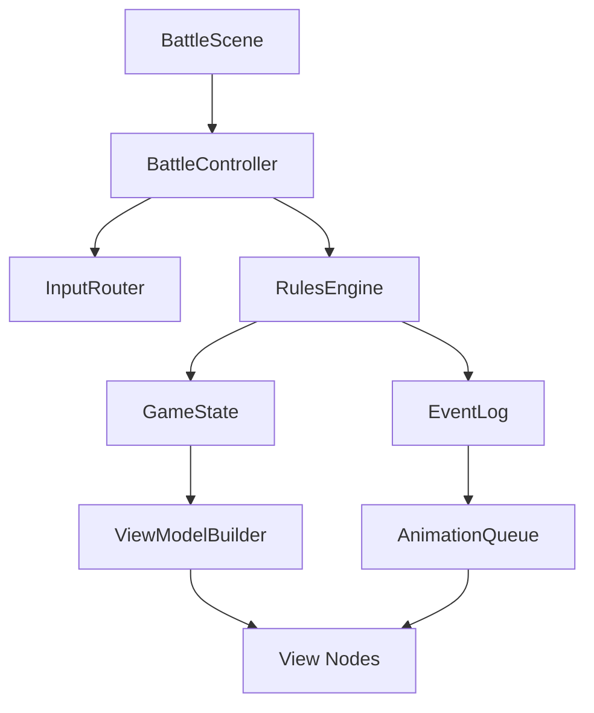

# 02 Godot 客户端设计

Godot 客户端负责桌面体验：牌桌、卡牌展示、拖拽、动画、音效、提示、调试工具。客户端不直接结算规则，只向规则引擎提交命令，并根据事件日志播放动画。

## 目标体验

参考影之诗的几个关键点：

- 手牌清晰，悬停时放大。
- 可行动卡牌高亮。
- 拖拽出牌和点击出牌都支持。
- 目标选择有明确范围提示。
- 效果结算有队列动画，不瞬间跳状态。
- 回合阶段和优先权提示明确。
- 复杂调试时能快速跳过动画。

## Godot 版本

本机可用版本：Godot 4.6.1.stable。

项目建议锁定 Godot 4.6.x。若后续团队成员版本不同，必须在 `docs/` 或项目 README 标注。

## 客户端分层



### BattleScene

Godot 场景入口，包含牌桌、双方区域、手牌、浮层、调试按钮。

职责：

- 组织节点。
- 连接信号。
- 承载 View 节点。
- 不写规则判断。

### BattleController

客户端控制器。

职责：

- 保存当前 `GameState` 引用。
- 将 UI 输入转换为命令。
- 调用规则引擎。
- 收集事件。
- 更新 ViewModel。
- 推送动画。

### InputRouter

输入路由器。

职责：

- 处理点击、拖拽、悬停。
- 管理当前交互模式：普通、选目标、选项、排序、支援选择。
- 根据 ViewModel 高亮合法操作。
- 生成命令 payload。

### AnimationQueue

动画队列。

职责：

- 按事件顺序播放动画。
- 支持快进、跳过、慢速调试。
- 支持动画完成后再刷新最终状态。

### ViewModelBuilder

规则状态到 UI 展示数据的转换器。

职责：

- 区分公开信息和调试信息。
- 生成每张牌的位置、状态、可交互标记。
- 生成阶段提示、优先权提示、可响应提示。

## 推荐场景结构

```text
client/scenes/
  main.tscn
  battle/
    battle_scene.tscn
    table_root.tscn
    player_board.tscn
    battle_slot.tscn
    hand_area.tscn
    card_view.tscn
    card_zoom.tscn
    phase_banner.tscn
    stack_panel.tscn
    choice_panel.tscn
    debug_panel.tscn
  cards/
    card_front.tscn
    card_back.tscn
    morale_card.tscn
    calamity_card.tscn
  overlays/
    target_arrow.tscn
    damage_number.tscn
    keyword_badge.tscn
```

## 根节点建议

```text
BattleScene (Control)
  BackgroundLayer
  TableLayer
    OpponentBoard
    CenterLine
    LocalBoard
    ZoneButtons
  CardLayer
    BoardCards
    HandCards
    FloatingCards
  EffectLayer
    Arrows
    Particles
    DamageNumbers
  UILayer
    PhaseBanner
    TurnButton
    StackPanel
    ChoicePanel
    CardZoom
    LogPanel
  DebugLayer
    DebugPanel
```

说明：

- `CardLayer` 独立出来，方便卡牌飞行动画跨区域移动。
- `UILayer` 不要被牌桌缩放影响。
- `DebugLayer` 可开关。

## 牌桌区域

根据牌桌图，需要支持：

- 天灾值。
- 天灾牌。
- 我方前排。
- 我方后排。
- 对方前排。
- 对方后排。
- 主宰。
- 主宰血量。
- 圣物。
- 士气牌库。
- 消耗区。
- 牌库。
- 墓地。
- 手牌。

### 坐标系统

规则核心使用统一坐标：

```text
player 0:
  front[0..2]
  back[0..2]

player 1:
  front[0..2]
  back[0..2]
```

UI 将对手区域镜像显示。不要让 UI 镜像影响规则坐标。

### 屏幕布局

建议第一版使用 `Control` UI，不急着上 3D。

桌面窗口基础尺寸：

- 16:9：1920x1080。
- 最小：1366x768。
- 支持缩放。

牌桌中心：

- 中央为 6x2 战场格。
- 上方对手，下方我方。
- 左右侧放牌库、墓地、士气、圣物、天灾。
- 手牌在底部展开。

### 响应式适配

使用锚点和比例布局：

- 战场区域固定比例。
- 卡牌尺寸根据窗口高度计算。
- 手牌最大展开宽度固定。
- 右侧日志和调试面板可折叠。

## 卡牌 View

`CardView` 应只展示 `CardViewModel`。

```gdscript
class_name CardViewModel

var instance_id: String
var definition_id: String
var display_name: String
var card_type: String
var faction: String
var cost: String
var power: String
var hp: String
var text: String
var image_path: String
var face: String
var orientation: String
var zone: String
var owner: int
var controller: int
var can_play: bool
var can_attack: bool
var can_activate: bool
var can_be_targeted: bool
var keywords: Array[String]
var badges: Array[Dictionary]
```

### 状态表现

- 活跃：正常竖置。
- 休整：旋转 90 度或横置。
- 可打出：边框高亮。
- 可攻击：攻击箭头或红色边缘。
- 可发动效果：蓝色或金色标记。
- 可作为目标：目标圈高亮。
- 被禁止：灰化。
- 被覆盖：只显示背面或覆盖牌背。

### 卡牌放大

悬停或长按显示 `CardZoom`：

- 牌图。
- 卡名。
- 类型、阵营、费用、兵力、天灾等级。
- 规则文本。
- 当前 modifier 列表。
- 调试模式下显示 instance id 和效果 id。

## 输入交互

### 基础操作

- 点击手牌：显示可打出位置或目标。
- 拖拽手牌到区域：尝试出牌。
- 点击军团：若可攻击，进入目标选择。
- 拖拽军团到目标：宣告进攻。
- 点击圣物或主宰：显示可发动效果。
- 点击牌库/墓地：打开查看面板。
- 点击结束回合：提交 `EndPhaseCommand`。

### 目标选择

进入目标选择模式后：

1. 输入路由器请求规则引擎给出合法目标。
2. UI 高亮目标。
3. 玩家点击目标。
4. 生成 `ChooseTargetCommand` 或完整命令。

### 选项选择

卡牌有“选择以下一项”时，显示 `ChoicePanel`。

要求：

- 不用在场景中硬编码卡名。
- 选项来自 `ChoiceRequest`。
- 可显示取消按钮，若规则允许取消。

### 排序选择

查看牌库顶部 N 张后自选顺序返回，需要 `OrderCardsPanel`。

功能：

- 显示可排序卡牌。
- 拖拽调整顺序。
- 选择返回顶部或底部。
- 提交 `OrderCardsCommand`。

## 动画事件映射

事件到动画：

| 事件 | 动画 |
| --- | --- |
| CardDrawn | 牌库飞到手牌 |
| CardPlayed | 手牌飞到战场或效果区 |
| CardMoved | 源区域飞到目标区域 |
| MoraleConsumed | 士气横置或进入消耗区 |
| EffectPutOnStack | 效果卡/图标进入堆叠面板 |
| EffectResolved | 堆叠顶部闪光并移除 |
| AttackDeclared | 攻击箭头 |
| DamageDealt | 伤害数字 |
| CardDied | 破碎或淡出到墓地 |
| CalamityRevealed | 天灾牌翻开大展示 |
| WinnerDecided | 胜负弹窗 |

### 动画策略

规则引擎一次命令可能产生很多事件。动画队列按事件播放，但状态最终以规则状态为准。

两种模式：

- 正常模式：按动画逐步展示。
- 调试模式：跳过动画，直接刷新最终状态。

## 调试面板

早期调试面板非常重要。

当前实际客户端状态补充：

- 己方圣物区已从占位区改为真实可点击落点，可将 `artifact` 手牌直接打到 `artifact_zone`。
- 敌方圣物区当前仍以展示数量为主，未开放交互。
- 若己方圣物区中只有一个可发动主动效果，当前可直接点击圣物区触发；多圣物或多效果选择 UI 仍未接通。
- 当前侧栏已提供最小 `Pass` 按钮，用于堆叠存在时手动过优先权并完成结算。
- 当前战术牌已接通最小客户端施放链路：
  - 无目标战术会在点击手牌时直接施放。
  - 单目标单位战术可在选中后点击目标单位施放。
  - 主宰目标战术可在选中后点击敌方主宰施放。
  - 若同一张战术卡存在多个可施放效果，当前会先弹出最小模式选择面板，再进入对应目标选择。
- 当堆叠存在时，手牌区当前会切换显示 `priority_player` 的手牌，便于最小响应链路成立。
- 当前 `counter_tactic` 已接通最小客户端入口：
  - 若只有一个可反制的 stack item，点击手牌可直接施放。
  - 堆叠存在时会显示最小 `stack` 面板；若存在多个可反制的 stack item，可直接在该面板点击目标项。
- 当前 `stack` 面板已与 `CardZoom` 联动，悬停 stack 项时可查看其来源卡、对应效果文本、控制者、目标与是否可响应。
- 当前桌面调试对局已不再使用硬编码 6 张开发小牌组，默认改为从 `res://data/decks/demo_starter_duel.json` 读取双方预组。
- 当前默认预组为双方各 `40` 张，并已切到第一批 `demo_*` 正式 Demo 卡，不再直接混用 `dev_*` / `qa_*` 测试牌作为默认对局牌表。
- 当前默认两套预组都已接入自己的检索牌：晨锋压制新增晨锋检索战术，暮纱控制保留暮纱检索战术，默认对局中更容易实际触发 `ChoicePanel`。
- 当前晨锋预组也已接入“多模式战术 + 检索 choice”复合链路：可先在模式面板中选择检索或主宰直伤，再在检索分支里继续点选具体候选牌。
- 当前暮纱预组已进一步接入“多模式战术 + 检索 choice”复合链路：可先在模式面板中选择检索或弹回，再在检索分支里继续点选具体候选牌。
- 当前 `player_deck`、`player_grave`、`enemy_grave` 与双方 `cost_deck` 已可点击打开最小查看面板，直接浏览当前区域中的卡牌列表。
- 当前 `search_deck` 已接通最小手动选择闭环：若检索候选只有 1 张则自动拿取；若候选多于 1 张，则会弹出 `ChoicePanel` 供当前玩家点选 1 张加入手牌。
- 多目标战术 UI 仍未实现；多模式战术的最小模式选择面板已接通。

必须功能：

- 查看完整状态 JSON。
- 查看命令日志。
- 查看事件日志。
- 查看当前堆叠。
- 查看 pending triggers。
- 查看所有 modifier。
- 抽指定卡。
- 加指定士气。
- 设置主宰血量。
- 设置天灾值。
- 翻开指定天灾。
- 将牌从任意区域移动到任意区域。
- 强制执行事件。
- 保存回放。
- 读取回放。

调试面板命令必须走 `DebugCommand`，不要直接改 UI 或状态。

当前最小实现口径：

- 保存回放：调用规则引擎导出 replay 数据，再通过 `ReplayIO.save_replay_data()` 写入 `user://replays/`。
- 读取回放：当前通过 `ReplayIO.find_latest_replay_path()` 读取 `user://replays/` 下最新一个 `.json`，再用 `ReplayRunner.run_replay_file()` 重建状态。
- 若回放文件 schema 不合法、`ruleset_id` 不匹配、卡池加载失败、命令执行失败或 hash 不一致，界面应显示失败 code，而不是静默继续。

## 资源管理

### 卡图

当前资料中有 PDF 卡图，但第一阶段不要求完整美术切图。建议：

- 使用临时通用卡框。
- 用文字卡先完成规则。
- 后续再导入正式卡图。

目录：

```text
client/assets/cards/
  placeholder/
  factions/
  calamities/
```

### 字体

中文字体必须明确打包。建议：

```text
client/assets/fonts/
  NotoSansSC-Regular.otf
  NotoSansSC-Bold.otf
```

### 主题

Godot Theme：

```text
client/themes/battle_theme.tres
client/themes/debug_theme.tres
```

避免把按钮样式散落在各个场景。

## 保存与回放文件

桌面客户端保存目录：

```text
user://saves/
user://replays/
user://logs/
user://decks/
```

回放格式由测试文档定义。

## 客户端状态机

客户端需要自己的交互状态机，不等同于规则阶段。

```text
Idle
DraggingCard
SelectingPlaySlot
SelectingTarget
SelectingSupport
ChoosingOption
OrderingCards
WaitingForAnimation
WaitingForOpponentInput
DebugInspecting
```

每个状态定义：

- 可点击对象。
- 可取消方式。
- 可提交命令。
- 高亮规则。

## 错误反馈

规则引擎拒绝命令时返回：

```gdscript
{
  "ok": false,
  "code": "NOT_ENOUGH_MORALE",
  "message": "士气不足",
  "details": {}
}
```

UI 显示短提示，不弹阻塞窗口。

## UI 不应做的事

UI 禁止：

- 自己扣血。
- 自己抽牌。
- 自己把牌放进墓地。
- 自己判断效果是否触发。
- 自己判断天灾是否触发。
- 自己记录 once per turn。
- 自己计算胜负。

UI 可以：

- 请求合法操作列表。
- 高亮目标。
- 播放动画。
- 展示状态。
- 提交命令。

## MVP 客户端范围

第一版需要：

- 一张牌桌。
- 双方区域。
- 可用文字牌。
- 手牌、牌库、墓地数量。
- 点击/拖拽出牌。
- 点击进攻。
- 阶段按钮。
- 堆叠面板。
- 选择面板。
- 调试面板。
- 回放保存和加载。

暂不需要：

- 完整主菜单。
- 复杂粒子。
- 卡包开封。
- 联机房间。
- AI 按钮。
- 全套卡图。

## 后续扩展

当规则稳定后添加：

- 主界面。
- 创建房间。
- 本地对战历史。
- 牌库构筑。
- 卡牌收藏。
- AI 对手。
- 局域网或服务器联机。
- 观战和回放播放。
