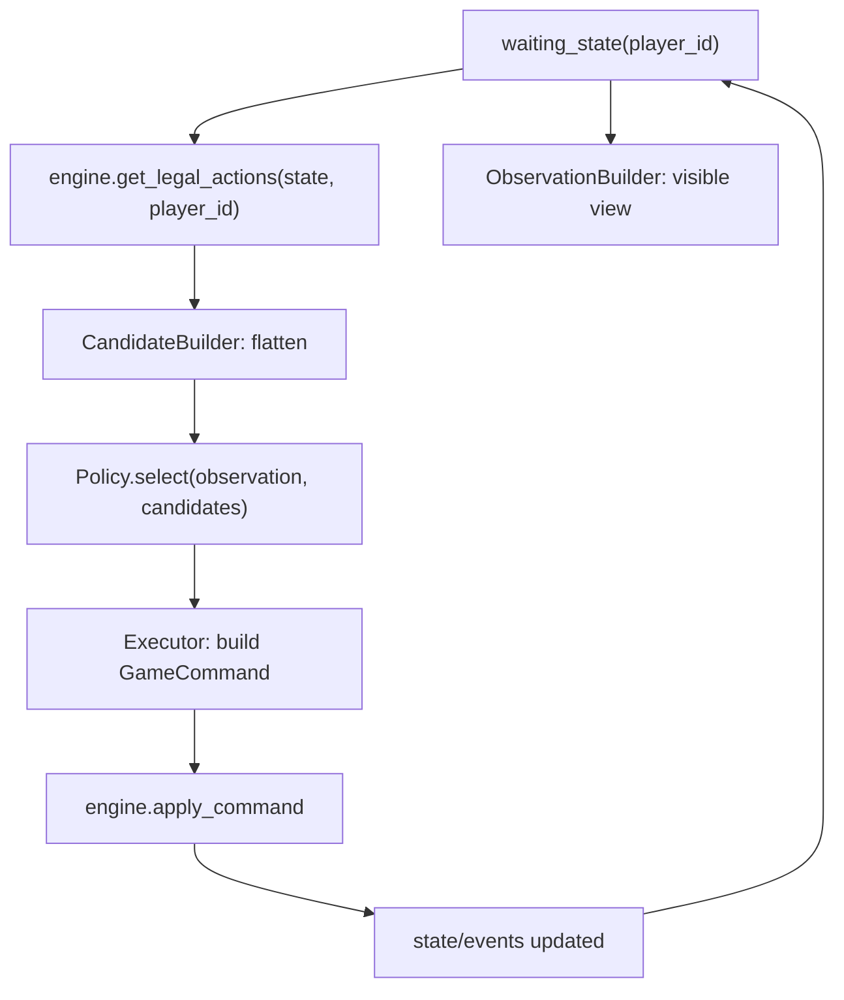

# 09 AI 开发方案

本文档用于指导后续 AI 功能开发落地，覆盖脚本型 AI（可复现、可测试、可跑局）与接入 LLM 的 AI（高层决策增强、可降级），并约束 AI 与规则引擎、客户端、回放体系的协作边界。

## 目标

1. 让 AI 能在不修改规则核心语义的前提下完成整局对战，并且所有行为可回放复现。
2. 让 AI 具备“卡组风格驱动”的策略框架：不同卡组可加载不同策略画像，而不是全局统一的固定倾向。
3. 让 AI 成为自动化测试与稳定性回归的工具：可自博弈跑 N 局，发现规则边界问题。
4. 为 LLM 接入预留稳定接口：LLM 只负责从合法动作中做选择，不承担规则判定。

## 非目标

1. 不在第一阶段追求“强度最优”或完整博弈搜索。
2. 不要求第一阶段就适配联机对战；联机接入以“命令一致性与隐藏信息”稳定后再做。
3. 不在本文档中确定具体的估分细节、权重数值与特征工程的最终形态；本文档只定义框架与接口。

## 关键约束

### 1) 只从合法动作中选择

规则引擎已提供 `get_waiting_state()` 与 `get_legal_actions()`，AI 的职责是从合法动作列表中做选择，而不是“拼命令”或“绕过验证”。

约束：

- AI 只能基于 `get_legal_actions(state, player_id)` 返回的 action proposal 决策。
- AI 执行前必须二次确认 proposal 仍然存在（例如通过 proposal_id 匹配）。
- AI 执行使用规则引擎正常入口：`validate_command()` / `apply_command()`。

### 2) 确定性与可回放

项目的核心要求是确定性回放。AI 需要满足：

- 同一个 seed、同一份牌库、同一序列命令，必须可复现同一结果。
- AI 内部随机必须可控：随机来源必须固定且可记录。
- LLM 模式必须支持降级：在无法稳定复现的情况下，至少可回放到“同样的命令序列”。

建议：

- 脚本型 AI 的随机使用独立 RNG，并把 RNG 关键状态记录进 replay 或战斗日志（不要求记录每一次 next_int，只要求能复现选择）。
- LLM AI 默认不追求“相同局面必选同一动作”，但必须支持缓存与固定温度；并在需要可复现实验时支持“固定候选集哈希 -> 固定输出”的缓存策略。

### 3) 隐藏信息隔离

AI 只能使用当前玩家可见的信息。尤其在未来联机/对战中：

- 不能读取对手手牌、对手牌库顺序、对手私密随机状态。
- Observation 构建器必须以 player view 生成输入，确保不会把私密信息泄露给脚本 AI 或 LLM。

### 4) 性能与超时

- 脚本型 AI 需要满足“每步决策近似即时”，支持 UI 练习与 headless 批量跑局。
- LLM AI 必须有超时与降级策略；超时后必须回退脚本型 AI，避免卡死对局推进。

## 现有工程接口综述

### 规则引擎侧（输入/输出）

- 等待态：`get_waiting_state(state)` → `WaitingForAction / WaitingForPriority / WaitingForChoice / GameOver`
- 合法动作：`get_legal_actions(state, player_id)` → 标准化 action proposals（含 kind、payload_template、targets 等）
- 命令执行：`apply_command(state, command)`（内部会调用 validate，再推进事件队列与持续效果刷新）

### 客户端侧（动作缓存）

客户端已通过 `_player_actions()` 缓存 `get_legal_actions` 的结果，并以 waiting player 决定当前输入席位。这意味着 AI 接入点可以是“当轮到某个席位输入时，由 AI 替代 UI 提交命令”。

### 现有原型

仓库已有 `tools/network_autoplayer.gd` 的启发式自动操作原型，但它耦合 UI/牌桌脚本，适合作为参考，不建议作为长期 AI 框架继续扩写。

## 总体架构

推荐将 AI 作为独立模块（例如 `ai/`），由运行时控制器与策略实现解耦。

### 组件职责

- AiController：驱动 AI 的主入口，负责“何时决策、何时执行、超时与降级、日志记录”。
- ObservationBuilder：从 `GameState + player_id` 构建 AI 可见的 observation（禁止泄露隐藏信息）。
- CandidateBuilder：基于 `get_legal_actions()` 生成候选列表；将 targets/choices 规范化为可直接执行的候选项。
- Policy：做决策，输入 observation + candidates，输出 decision（候选 id + 选择的 target/option 等）。
- Executor：把 decision 转为 `GameCommand` 并提交给规则引擎；处理失败重试与降级。
- Telemetry：记录决策过程（候选集摘要、选中项、原因、耗时、哈希），用于调试与回放审计。

### 数据流（每个输入窗口）



## Action Proposal 标准输入

`GameEngine.get_legal_actions()` 产出的 proposal 已经是标准化 schema（并且测试里对 schema 有回归要求）。AI 层需要把 proposal 转成“可执行候选”：

- `pass_priority`：无需目标。
- `end_phase`：无需目标。
- `resolve_choice`：需要从 candidate_card_ids / options 里做选择。
- `play_card` / `activate_effect` / `declare_attack` / `choose_defense` / `move_legion`：可能需要目标或 preset payload。

CandidateBuilder 的原则：

1. 尽量不丢字段：保留 proposal_id、kind、payload_template、targets、extra。
2. 在候选上增加可读描述（用于调试与 LLM prompt）。
3. 在“一个 proposal 多个 targets”的情况下，可选择两种模式：
   - 扁平化：每个 target 变成一个独立候选（适合简单策略/LLM）。
   - 保留 targets：由 policy 再选 target（适合复杂策略）。

建议第一版用“扁平化候选”，减少 policy 的复杂度。

## 脚本型 AI（Scripted AI）

### 目标

- 不依赖 LLM 服务即可完整打完一局。
- 可在 headless 环境批量跑局，作为稳定性与回归工具。
- 策略以“卡组风格画像（Deck Profile）”驱动，允许对局中对对手风格做弱推断并调整倾向。

### 策略画像（Deck Profile）

核心思想：估分器不写死“攻击优先/控场优先”，而是把倾向放在 profile 配置中。

建议 profile 包含：

- `profile_id`：例如 `rush / midrange / control / combo / tempo / value / stall / ramp`
- `tags`：用于组合玩法标记（如 `calamity`, `artifact`, `rune`, `divine_power`）
- `feature_weights`：特征权重表（具体特征与权重后续再定）
- `matchup_adjustments`：面对某类对手画像的权重偏移（可选）
- `opening_plan`：开局策略提示（可选）
- `risk_policy`：风险偏好（例如偏保守/偏激进）

### 对手风格推断（Opponent Profile Guess）

对手画像推断原则：

- 只使用公开信息（对手已打出牌、公开区域、对手行为、回合节奏等）。
- 输出为概率分布而非单一标签，避免误判导致策略大幅偏航。
- 推断用于“轻微修正”而不是覆盖自家画像。

当前已落地的最小骨架：

- `ai/scripted/opponent_profile_guesser.gd`
- 基于公开主宰画像给出弱先验
- 叠加少量公开场面信号（例如场上单位数量、墓地密度）做轻微偏移
- 输出结构包含 `primary_profile_id / distribution / reasons`

示意：

```json
{
  "unknown": 0.55,
  "control": 0.25,
  "combo": 0.20
}
```

### 估分框架（不含具体分数）

建议将打分拆成：

- 特征抽取：从 `(state, candidate)` 生成 feature 向量（例如资源变化、场面变化、风险、收益等）
- 权重合成：`score = dot(features, self_profile_weights) + dot(features, matchup_delta(opponent_guess))`
- 规则过滤：对明显不合理动作做硬过滤（例如必败动作、重复无意义 pass 等）
- 决策输出：返回候选 id，并带上 `reason`（用于调试）

当前已落地的最小骨架：

- `ai/scripted/profile_feature_extractor.gd`
- 输出 `score / trace / bucket_totals`
- 当前 bucket 包括 `base / timing / action_kind / deploy / combat / matchup`
- `scripted_policy_profile.gd` 已将这些调试字段挂到 decision 上
- `scripted_policy_profile.gd` 现已支持阶段化 profile：在进入评分前根据血线、手牌、前排数量与回合节奏，从 `opening / midgame / closing / desperation` 中选择一个阶段，并以 `weights_by_stage` 覆盖基础 `weights`
- 当前 decision 额外暴露 `stage_id / stage_reasons`，battle log 摘要也会带上 `stage=...`
- `ai/scripted/candidate_simulator.gd` 现已提供最小版轻量前瞻：对静态评分的 top-N 候选重放当前命令日志克隆出模拟态，试走一步后根据主宰血量、前后排数量、场面损失、手牌保留，以及是否保住己方行动窗口或把优先权窗口交给对手做二次加减分
- 当前 decision 与 top-k 候选额外暴露 `simulation_score / simulation_summary / simulation_breakdown`，便于比较“静态分高但后续站不住”的动作；`simulation_breakdown` 会直接给出手牌变化、己方站场增减、堆叠/待响应窗口等结构化差值
- 特征层新增“关键资源保留”信号：`plays_hand_response* / plays_counter_tactic*`，用于识别“为了挡这次伤害交响应牌会把手牌打空”的风险
- 防守侧现已补入“交防守资源后的真空”信号：`defense_with_supporter_preserves_hand` 与 `defense_master_guard_*`，用于区分“保住这一拍”与“保住这一拍但把下回合手牌打空”
- 防守侧进一步补入“是否仍保有反打窗口”信号：`defense_support_preserves_counterattack_window / defense_master_guard_keeps_counterattack_window / defense_master_guard_only_buys_time`
- 主动技/神器启动现已补入“窗口保留”信号：`activate_artifact_effect*`，用于区分“在收口窗口启动神器”与“在低手、无压力时过早交出高价值启动”

### 必须优先处理的 waiting state

1. `WaitingForChoice`：必须选择并提交 ResolveChoice。
2. `WaitingForPriority`：优先处理防御/响应/过优先权，且要避免死循环。
3. `WaitingForAction`：主阶段出牌、移动、进攻、结束阶段等。

脚本 AI 第一阶段建议保底策略：

- 若只有 1 个候选，直接执行。
- 若是 choice 且候选卡/选项多于 1：先实现最小规则（例如选第一项），后续再接入风格化逻辑。
- 若是 priority window 且无明显响应动作：执行 pass_priority。

### 日志与调试

每一步建议记录：

- `turn_number / phase / waiting_state`
- `public_state_hash`（若可得）
- 候选集摘要（proposal_id、kind、简要描述）
- 选中候选与原因（score、top-k）
- 决策耗时（ms）

当前本地对局最小实现：

- `AiController` 若收到 `debug_summary`，会写入 battle log 文件
- 当前摘要格式为 `profile / opponent guess / kind / command / score / top-k`
- `decision` 已包含 `top_candidates / score_trace / bucket_totals / feature_summary`
- top-k 候选当前会附带各自的命中特征摘要，便于直接比较“为什么第一名压过第二名”
- 当前特征已覆盖关键卡、墓地阈值、血线、场面数量、目标价值、关键敌方单位、同列支援、己方发起列是否有后排支撑、最后前排清线机会、清线后是否形成下回合主宰单路/多路直通压力、是否已逼近下回合斩杀压力、这些压力是否会被单卡守卫稀释、压过单卡守卫，或进一步逼出多卡守卫资源、手牌压迫与反打真空、主宰守卫风险分层（单卡可守 / 仅多卡可守）、明牌反制风险，以及“交支援是为了保主宰还是保场面”的防守意图

## LLM AI（LLM-Backed AI）

### 定位

LLM 负责“从合法候选中做高层选择”，不负责规则判定、不拼接非法命令、不读取隐藏信息。

推荐混合策略：

- 高频、强约束的窗口（choice、priority、防御）由脚本 AI 处理。
- 低频、需要策略取舍的窗口（main phase 多候选）交给 LLM 决策。

### 接入形态

建议 LLM 在外部服务层完成模型调用、prompt 模板、卡牌文本检索与输出校验。Godot 内只保留轻薄客户端：

- LlmClient：HTTP 请求、超时、重试、解析
- LlmPolicy：将 observation + candidates 序列化为 request，并把 response 映射回候选 id

### 超时与降级

- LLM 请求超时必须回退脚本 AI。
- 输出 JSON 解析失败、候选 id 不存在、字段缺失等，都必须回退。
- 回退策略必须可配置（例如回退到 scripted policy 的哪个 profile）。

### Prompt 输入建议

输入由三部分组成：

1. 观测（observation）：只包含可见信息，包含自家卡组风格画像与对手画像推断。
2. 候选（candidates）：扁平化候选列表，每个候选有 `candidate_id`、动作描述、payload 摘要、目标描述、代价摘要。
3. 卡牌引用（optional）：仅提供候选涉及卡牌的规则文本摘要，避免 prompt 过长。

### Response 输出建议

要求模型输出结构化 JSON：

```json
{
  "candidate_id": "c_012",
  "confidence": 0.62,
  "brief_reason": "..."
}
```

并由本地进行候选存在性校验后再执行。

## 配置与数据建议

建议新增数据目录（后续落地时由工具/数据 agent 实现）：

```text
data/ai/
  profiles.json
  matchup_rules.json
```

示例 schema（仅示意，字段可增量演进）：

```json
{
  "profiles": [
    {
      "profile_id": "midrange",
      "tags": ["legion", "tempo"],
      "feature_weights": {},
      "matchup_adjustments": {},
      "risk_policy": {"kind": "balanced"}
    }
  ]
}
```

卡组与 profile 的绑定方式建议二选一：

1. 在 deck json 中增加 `ai_profile_id`
2. 在独立映射表中维护 `deck_id -> ai_profile_id`

当前已落地的最小骨架采用“多级覆盖”：

1. 若 deck 的 `players[i].ai_profile_id` 存在，则优先使用。
2. 若 `data/ai/profiles.json` 中存在 `deck_id + player_index` 映射，则使用该映射。
3. 若能根据 `master_id` 命中主宰映射，则使用主宰默认画像。
4. 都未命中时退回 `default_profile_id`。

当前代码入口：

- profile 配置文件：`data/ai/profiles.json`
- registry：`ai/scripted/deck_profile_registry.gd`
- profile 驱动策略骨架：`ai/scripted/scripted_policy_profile.gd`
- 候选扁平化：`ai/core/action_candidate_builder.gd`
- 若 profile 提供 `weights_by_stage`，策略层会先保留 `weights` 作为基线，再把命中阶段的增量权重覆盖进去

## 两套预组画像分析

### 高天原预组

建议画像：`takamagahara_starter_tempo`

核心思路：

- 前中期尽快用远程/先手攻击建立血线优势。
- 优先用点杀和封反击手段清掉拦路单位，而不是无脑抢脸。
- 中盘依赖草薙剑、天诛、花魁的馈赠、须佐之男主动技把节奏拉开。
- 终盘用本多忠胜、宫本武藏、真田幸村与主宰增伤完成斩杀。

权重设计原则：

- `activate_effect` 要高于通用 tempo，因为草薙剑、花魁、须佐之男主动技都属于高质量动作。
- `attack_master` 不应过高，否则会错过清关键站场和封反击窗口。
- 对 `源义经 / 源博雅 / 桂小五郎 / 草薙剑 / 天诛 / 花魁的馈赠 / 本多忠胜` 给额外 source_def 权重。
- 当对手血线进入 6 或 3 以下时，提高终结倾向。

### 阿斯加德预组

建议画像：`asgard_starter_grave_midrange`

核心思路：

- 开局以守线和交换为主，让墓地逐步累积资源。
- 中盘通过洛基、古斯塔夫一世、猎杀时刻、女武神的召唤把墓地转成卡差和返场。
- 这套牌不是纯控制，更像“能拖长局的中速牌组”，因此需要站场、返场、回血、再压回合节奏。
- 后续由拉格纳、黑胡子蒂奇、比约恩等高质量单位接管场面。

权重设计原则：

- `choose_defense` 和 `activate_effect` 要高于通用中速，因为这套牌强在交换后资源不亏。
- 墓地张数必须进入特征层，而不是只靠统一动作类别权重。
- 对 `女武神的召唤 / 古斯塔夫一世 / 奥拉夫二世 / 勇士比约恩 / 猎杀时刻 / 传奇的拉格纳` 给额外 source_def 权重。
- 当己方血线较低时，提高保守和返场资源动作的评分。

### 当前实现对应

- 上述两套画像已落到 `data/ai/profiles.json`
- 预组 deck 的 `players[i].ai_profile_id` 已更新为专属画像
- profile extractor 已支持 `source_def / source_faction / source_frontline / source_backline / source_has_supporter / source_open_no_support / self_grave_ge_* / self_master_hp_le_* / enemy_master_hp_le_* / board_units_ge_* / target_last_frontline / next_turn_master_single_lane_pressure / next_turn_master_multi_lane_pressure / next_turn_master_threat / next_turn_master_lethal_pressure / next_turn_pressure_blunted_by_single_guard / next_turn_multi_lane_overwhelms_single_guard / next_turn_lethal_through_multi_guard_tax / next_turn_multi_lane_draws_multi_guard / next_turn_multi_guard_consumes_half_hand / next_turn_multi_guard_nearly_exhausts_hand / next_turn_multi_guard_leaves_low_hand / next_turn_multi_guard_forces_topdeck / defense_support_protects_master / defense_support_protects_board / master_guard_single_card_risk / master_guard_multi_card_only` 等特征键
- 对局修正只会在命中特征时生效，不再无条件叠加

## 测试与验收

### 最小验收（脚本型 AI）

- AI 能从开局推进到 GameOver。
- 自博弈跑 100 局无崩溃、无死循环、无非法命令。
- 同一 seed 下重复跑局，命令序列可复现（至少在脚本随机固定时）。

### 建议新增测试类型

1. `tests/unit/test_ai_action_flatten.gd`：校验候选扁平化稳定、target 映射正确。
2. `tests/unit/test_ai_observation_visibility.gd`：校验 observation 不包含对手私密信息。
3. `tests/unit/test_scripted_ai_smoke.gd`：最小跑局冒烟测试（到达 GameOver 或达到回合上限）。
4. `tools/run_ai_selfplay.gd`：headless 自博弈批跑脚本，输出统计与失败 replay。

### LLM 模式验收

- 任意 LLM 失败都能在超时上限内回退脚本 AI 并继续对局。
- 不泄露隐藏信息（通过 observation 测试保证）。
- 记录可审计：至少记录每次 LLM 请求的候选集哈希、选中 id、耗时、回退原因。

## 里程碑拆分

### M0：接口与最小接入

- 建立 `ai/` 目录与核心接口（controller/observation/candidates/policy/executor）。
- 在本地对局模式添加 AI 席位开关（仅替代玩家输入提交命令）。

### M1：随机合法行动

- 实现 RandomPolicy：从候选中随机挑选并执行。
- 打通最小跑局链路，完成 smoke test。

### M2：风格画像骨架

- 引入 DeckProfile 配置与加载。
- 实现 BasicPolicy：不追求强度，只实现“按 profile 切换策略框架”。

### M3：自博弈与稳定性回归

- 完成 headless 自博弈工具，跑 100 局稳定。
- 将失败用 replay 保存/定位。

### M4：LLM 接入（可降级）

- 接入外部 LLM 服务与本地 LlmClient。
- 先只接管主阶段复杂决策，其余窗口脚本处理。

## 协作边界与文件所有权建议

参考 `05_多Agent开发规范` 的目录边界，新增建议：

- `ai/`：AI agent 或架构负责人维护公共接口；策略实现可由不同 agent 分工，但不应改规则核心。
- `tools/`：添加自博弈 runner、日志导出等工具时归工具 agent。
- `tests/`：新增 AI 相关测试归测试 agent。

规则核心若需额外“可见状态快照”或“更标准的 action schema”，必须走接口变更流程：先提需求，再由规则核心 agent 增加公开 API。

## 风险清单

1. AI 误用隐藏信息导致未来联机/对战不公平：必须通过 observation 层隔离。
2. priority/choice 窗口处理不当导致死循环：必须有 guard 与回退策略。
3. LLM 输出不稳定导致不可控：必须限制作用范围并强制降级。
4. 候选扁平化与 payload 映射出错导致非法命令：必须有单元测试覆盖。
