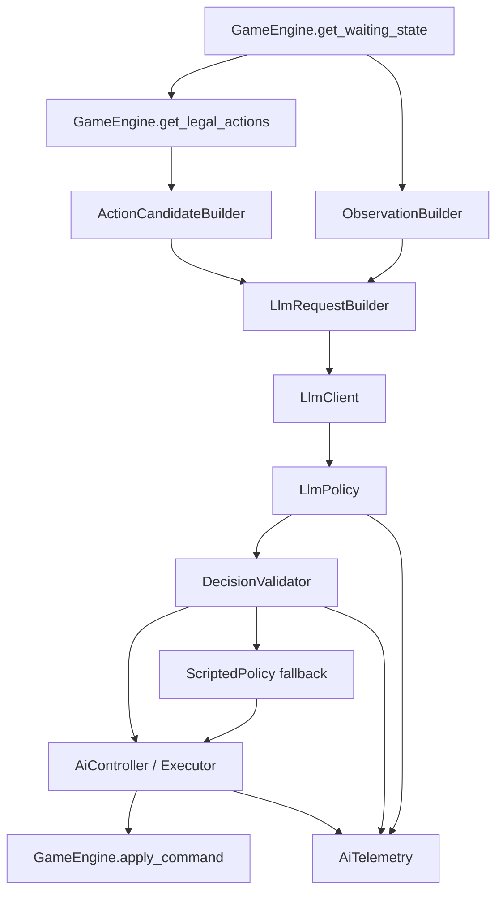

# 11 LLM 型 AI 开发方案

本文档定义《十二军团》LLM 型 AI 的完整落地方案。目标不是让 LLM 接管规则引擎，而是让 LLM 在规则引擎严格约束下，读取当前可见局面、规则/卡牌知识与完整合法候选，从候选中做高质量决策，并由本地系统校验后执行。

核心原则：规则引擎负责“什么能做、做了如何结算”；LLM 负责“在这些合法选择里，哪一个更好”。

## 目标

1. 打通最小闭环：LLM 能读取局面、合法候选、相关规则文本，返回候选 ID，并真实执行命令。
2. 保持规则扩展友好：未来新增卡牌、关键词、选择窗口时，优先通过 action proposal 与 observation schema 对接，而不是逐张牌改 AI。
3. 保证隐藏信息边界：LLM 只能看到当前玩家应当可见的信息。
4. 保证对局不会卡死：任何 LLM 超时、解析失败、候选失效、服务异常都必须回退脚本 AI。
5. 保证可审计：每次 LLM 决策必须记录候选哈希、输入摘要、输出、耗时、回退原因与最终命令。
6. 支持长期强度优化：通过 prompt、知识库、候选摘要、复盘日志与离线评测迭代，而不是把策略硬编码进规则层。

## 非目标

1. LLM 不负责判断动作是否合法。
2. LLM 不直接拼接任意命令，只能选择本地生成的候选。
3. 第一阶段不追求完整多步搜索、蒙特卡洛或自训练。
4. 第一阶段不要求联机对局中启用 LLM；联机接入必须在隐藏信息与命令同步稳定后再开放。
5. LLM 输出的自然语言理由只用于调试，不作为规则执行依据。

## 总体架构



推荐新增或完善的模块：

- `ai/core/observation_builder.gd`：构建当前玩家可见状态。
- `ai/core/action_candidate_builder.gd`：继续负责候选扁平化，并新增 `candidate_id` 与可读摘要。
- `ai/llm/llm_policy.gd`：决定哪些窗口交给 LLM、组装请求、解析响应、回退脚本策略。
- `ai/llm/llm_client.gd`：轻量 HTTP 客户端，负责超时、重试、JSON 解析。
- `ai/llm/llm_request_builder.gd`：把 observation、candidates、card_refs、rule_refs 组成模型输入。
- `ai/llm/decision_validator.gd`：校验 LLM 返回候选仍存在，映射回 command/payload。
- `ai/runtime/ai_controller.gd`：增加异步 LLM 请求状态、超时与降级执行。
- `ai/runtime/ai_telemetry.gd`：记录决策日志和可复盘字段。
- `data/ai/llm_settings.json`：模型、超时、接管窗口、回退策略等配置。
- `data/ai/rule_knowledge.json`：规则术语和通用策略提示。

## 决策边界

LLM 可接管的窗口应该逐步开放。

第一阶段建议：

- 只接管 `WaitingForAction`。
- 只在候选数大于等于 2 时调用 LLM。
- 优先接管主阶段的 `play_card / activate_effect / move_legion / declare_attack / end_phase`。
- `WaitingForChoice`、`WaitingForPriority`、防御响应窗口默认继续由脚本 AI 处理。

第二阶段再开放：

- 非致命防御选择。
- 多选、排序、检索类 choice。
- priority window 中的反击/响应取舍。

不建议早期交给 LLM 的窗口：

- 规则强约束、响应时间高频、容易卡死的 pass priority。
- 必须严格排序的复杂 choice。
- 需要隐藏信息保护还未验证的联机窗口。

## 稳定接口

LLM AI 只依赖以下规则引擎入口：

- `get_waiting_state(state)`
- `get_legal_actions(state, player_id)`
- `validate_command(state, GameCommand)`
- `apply_command(state, GameCommand)`

未来新增规则时，应优先保证 `get_legal_actions()` 暴露新操作，而不是让 AI 自己推断新规则。

Action proposal 需要尽量稳定包含：

```json
{
  "proposal_id": "play_card:c_0007",
  "kind": "play_card",
  "command_type": "PlayCard",
  "label": "Play ...",
  "payload_template": {},
  "source": {},
  "targets": [],
  "target_mode": "slot",
  "play_kind": "board_or_artifact",
  "cost": {}
}
```

候选扁平化后推荐结构：

```json
{
  "candidate_id": "cand_0012",
  "proposal_id": "play_card:c_0007",
  "kind": "play_card",
  "command_type": "PlayCard",
  "payload": {
    "card_id": "c_0007",
    "row": "front",
    "col": 1
  },
  "source": {
    "card_id": "c_0007",
    "card_name": "..."
  },
  "target": {
    "row": "front",
    "col": 1
  },
  "description": "将 ... 登场到己方前排 2 号位",
  "cost_summary": "消耗 2 士气，手牌 -1",
  "risk_summary": "会交出行动权：否",
  "tags": ["deploy", "frontline"]
}
```

`candidate_id` 必须在同一请求内唯一且稳定。推荐用候选序号加候选内容哈希，例如：

```text
c_00012_a84f91
```

本地执行时不得信任 LLM 返回的 payload，只能通过 `candidate_id` 查回本地候选 payload。

## Observation Schema

Observation 必须是当前玩家视角，而不是完整 `GameState`。

推荐顶层结构：

```json
{
  "schema_version": 1,
  "viewer_player_id": 0,
  "turn_number": 5,
  "phase": "main",
  "waiting_state": {
    "state": "WaitingForAction",
    "player_id": 0
  },
  "self": {},
  "opponent": {},
  "public_zones": {},
  "stack": [],
  "pending_attack": {},
  "recent_events": [],
  "profile": {},
  "opponent_guess": {}
}
```

`self` 可包含：

- 主将名称、主将 ID、当前生命、最大生命。
- 手牌完整列表，包括实例 ID、卡名、类型、费用、战力、阵营、规则文本摘要。
- 牌库数量，不包含顺序。
- 墓地、费用区、神器区公开卡牌。
- 前后排公开单位及状态。
- 可用士气、已消耗士气、关键标记。

`opponent` 可包含：

- 主将名称、主将 ID、当前生命、最大生命。
- 手牌数量，不包含手牌内容。
- 牌库数量，不包含顺序。
- 墓地、费用区、神器区公开卡牌。
- 前后排公开单位及状态。
- 已公开过的关键行动摘要。

禁止包含：

- 对手手牌内容。
- 对手牌库顺序。
- 任意私密 zone 的具体卡牌，除非规则已公开。
- 未公开随机结果。
- 调试命令、测试后门、完整内部 state dump。

## 规则与卡牌知识

LLM 输入不应每步塞完整规则书。推荐使用三层知识：

1. 固定系统规则摘要：胜利条件、阶段、攻击/防御、士气、堆叠、优先权、隐藏信息原则。
2. 当前候选涉及卡牌的规则文本：只提供 source、target、stack item、手牌候选中的相关卡牌。
3. 可选策略提示：卡组画像、对手画像、常见战术目标。

卡牌引用结构：

```json
{
  "card_id": "takamagahara_s01_0413",
  "name": "...",
  "type": "legion",
  "faction": "takamagahara",
  "cost": 2,
  "power": 3000,
  "text": "...",
  "summary": "登场后可以..."
}
```

规则知识结构：

```json
{
  "keyword": "master_guard",
  "summary": "主将被攻击时，可以按规则从手牌交出守卫卡抵消伤害。",
  "decision_hint": "只有在避免致命伤害或保住关键反击窗口时才应高优先级使用。"
}
```

## Prompt 设计

推荐 system prompt 固定表达边界：

```text
你是《十二军团》的对局 AI。你只能从 candidates 中选择一个 candidate_id。
不要创造新动作，不要修改 payload，不要假设隐藏信息。
规则引擎已经保证 candidates 全部合法，你的任务是选择最有胜率的候选。
优先考虑：避免立即败北、制造斩杀、扩大场面优势、保护关键资源、减少无收益消耗。
只输出 JSON。
```

User message 推荐包含：

```json
{
  "task": "choose_one_candidate",
  "observation": {},
  "candidates": [],
  "card_refs": [],
  "rule_refs": [],
  "output_schema": {
    "candidate_id": "string",
    "confidence": "number",
    "brief_reason": "string"
  }
}
```

模型输出：

```json
{
  "candidate_id": "c_0012",
  "confidence": 0.72,
  "brief_reason": "该动作能清掉最后前排并形成下回合主将压力，同时保留手牌。"
}
```

可选增强输出：

```json
{
  "candidate_id": "c_0012",
  "confidence": 0.72,
  "brief_reason": "...",
  "plan": "先清前排，再用剩余单位压主将。",
  "rejected": [
    {"candidate_id": "c_0008", "reason": "消耗高且不能立即改变场面"}
  ]
}
```

本地只使用 `candidate_id`，其他字段只进日志。

## LLM 调用策略

`LlmPolicy` 判断是否调用 LLM：

```text
if disabled:
  fallback
if waiting_state not allowed:
  fallback
if candidates.size < min_candidates:
  fallback
if candidate_count > max_candidates:
  summarize/prune or fallback
call LLM
```

建议默认配置：

```json
{
  "enabled": false,
  "model": "configured_external_model",
  "temperature": 0.2,
  "timeout_ms": 3500,
  "max_retries": 0,
  "allowed_waiting_states": ["WaitingForAction"],
  "allowed_kinds": ["play_card", "activate_effect", "move_legion", "declare_attack", "end_phase"],
  "min_candidates_for_llm": 2,
  "max_candidates_for_llm": 40,
  "fallback_policy": "scripted_profile",
  "log_full_request": false,
  "cache_enabled": true
}
```

候选过多时，不建议随意裁剪合法候选。可以先做摘要压缩：

- 保留所有 `end_phase`。
- 保留每张手牌每种用途的 top targets。
- 保留所有可能攻击主将、清最后前排、触发斩杀、防御保命的候选。
- 对同类低价值站位候选做 grouped summary，并保留可执行代表项。

如果无法安全压缩，则回退脚本 AI。

## 异步与超时

Godot 内 LLM 调用应避免阻塞 UI。

推荐状态机：

```text
IDLE
  -> REQUESTING_LLM
  -> LLM_DONE
  -> VALIDATING
  -> EXECUTING
  -> IDLE

REQUESTING_LLM
  -> TIMEOUT_FALLBACK
  -> FALLBACK_EXECUTING
  -> IDLE
```

`AiController` 需要记录：

- 当前请求的 `state_signature`。
- 当前请求的 `waiting_state`。
- 当前候选集哈希。
- 请求开始时间。
- 请求中的 player_id。

响应回来后必须验证：

1. 当前仍是同一个等待玩家。
2. 当前 waiting_state 仍兼容。
3. 候选集哈希仍一致，或重新生成候选后 candidate_id 仍能匹配。
4. 选中候选通过 `validate_command()`。

任何一项失败都回退或丢弃响应。

## 降级策略

必须回退的情况：

- LLM 请求超时。
- HTTP 失败。
- JSON 解析失败。
- 缺少 `candidate_id`。
- `candidate_id` 不存在。
- 候选已过期。
- 本地 validate 失败。
- 输出置信度低于配置阈值且启用了置信度门槛。

回退顺序建议：

1. `ScriptedPolicyProfile`。
2. `pass_priority` 或 `end_phase` 安全推进。
3. 第一个仍合法的候选。

回退也要记录日志：

```json
{
  "event": "llm_fallback",
  "reason": "timeout",
  "elapsed_ms": 3510,
  "candidate_hash": "...",
  "fallback_command": "PlayCard"
}
```

## 审计与日志

每次 LLM 决策建议记录 JSONL：

```json
{
  "event": "llm_decision",
  "game_id": "dev_game",
  "turn_number": 5,
  "phase": "main",
  "player_id": 0,
  "waiting_state": "WaitingForAction",
  "candidate_count": 18,
  "candidate_hash": "9b1a...",
  "model": "configured_external_model",
  "elapsed_ms": 1280,
  "selected_candidate_id": "c_0012",
  "confidence": 0.72,
  "brief_reason": "...",
  "command_type": "DeclareAttack",
  "payload": {},
  "fallback": false
}
```

日志默认不保存完整 prompt，避免泄露和文件膨胀。调试开关打开后可保存：

- observation 摘要。
- candidates 摘要。
- card_refs。
- 原始响应。

## 可回放与缓存

LLM 决策不天然确定。为了支持复盘，应区分两种模式。

普通游玩模式：

- 记录最终命令序列即可回放。
- 不要求相同局面再次询问 LLM 得到相同选择。

实验评测模式：

- 使用低温度。
- 以 `observation_hash + candidate_hash + model + prompt_version` 为 key 缓存响应。
- 缓存命中时不重新请求模型。
- 日志记录 prompt_version 和 knowledge_version。

缓存条目：

```json
{
  "cache_key": "...",
  "model": "...",
  "prompt_version": 1,
  "knowledge_version": 1,
  "response": {
    "candidate_id": "c_0012",
    "confidence": 0.72,
    "brief_reason": "..."
  }
}
```

## 隐藏信息测试

必须新增 `tests/unit/test_ai_observation_visibility.gd`。

覆盖：

- 玩家 0 的 observation 不包含玩家 1 手牌 ID。
- 玩家 0 的 observation 不包含玩家 1 牌库具体顺序。
- 公开区卡牌可以被双方看到。
- 自己手牌可以看到完整定义。
- choice 中已公开的 looked cards 只在规则允许时出现。
- pending attack、stack、grave、battlefield 等公开状态完整出现。

任何新增 zone 或新 choice 类型，都要补 observation visibility 测试。

## 候选映射测试

必须新增或扩展候选测试。

覆盖：

- 每个扁平候选都有唯一 `candidate_id`。
- 每个候选都能映射回 `command_type + payload`。
- LLM 返回不存在 candidate_id 时回退。
- LLM 返回合法 candidate_id 后，只使用本地 payload。
- target 展开不丢失 `row / col / target_card_id / target_player / defender_id / effect_id / master_guard_card_ids`。
- `resolve_choice` 支持 card pick、option pick、排序类 choice 的最小候选表达。

## LLM 策略测试

建议新增：

- `tests/unit/test_llm_policy_fallback.gd`
- `tests/unit/test_llm_decision_validator.gd`
- `tests/unit/test_llm_request_builder.gd`

用 fake client 模拟：

- 正常返回候选。
- 超时。
- 非 JSON。
- JSON 缺字段。
- 候选不存在。
- 候选过期。
- validate 失败。

验收标准：

- 所有失败都能在规定时间内回退。
- 对局继续推进。
- 不新增非法命令。
- 日志能说明回退原因。

## Headless 验收

新增 `tools/run_llm_ai_smoke.gd` 或在现有 selfplay 工具中加模式。

最小验收：

- fake LLM 固定选择第一个候选，能跑完 10 局。
- fake LLM 随机返回错误，仍能通过 fallback 跑完 10 局。
- fake LLM 延迟超过 timeout，仍能通过 fallback 跑完 10 局。
- scripted vs LLM-hybrid 能至少跑完 20 局无卡死、无非法命令。

强度验收不在第一阶段要求，但应记录：

- 胜率。
- 平均回合数。
- fallback 率。
- LLM 平均耗时。
- 非法/过期候选率。
- end_phase/pass_priority 异常频率。

## Prompt 与知识迭代闭环

长期优化流程：

1. 跑 LLM 自博弈或 scripted vs LLM。
2. 抽取低质量决策：空过、白烧资源、错过斩杀、漏防、过度守卫、无收益移动。
3. 从日志拿到 observation、候选、LLM 理由与实际结果。
4. 优先改候选摘要和知识引用，其次改 prompt，最后才改脚本 veto。
5. 把典型失败沉淀成固定 case。

建议维护 `docs/AI_LLM_复盘样例.md` 或 `data/ai/llm_cases/`：

```json
{
  "case_id": "missed_lethal_001",
  "seed": 620003,
  "turn": 7,
  "bad_candidate": "c_0008",
  "preferred_candidate": "c_0012",
  "reason": "LLM 低估了双路主将压力",
  "fix": "候选摘要增加 projected_master_damage"
}
```

## 与未来新卡/新规则的兼容

新增卡牌时，LLM AI 理想上不需要改代码，只需要：

1. 卡牌数据包含完整规则文本和可摘要字段。
2. 规则引擎正确结算效果。
3. `get_legal_actions()` 正确暴露所有合法动作。
4. CandidateBuilder 能把新 action proposal 转成可执行候选。
5. ObservationBuilder 能暴露相关公开状态。

只有以下情况需要改 AI 框架：

- 新增 waiting state。
- 新增 action kind。
- 新增 target/choice 结构。
- 新增公开/隐藏信息边界。
- 新增需要特殊解释的全局规则或关键词。

因此 action proposal schema 要当作规则引擎和 AI 的长期契约维护。新增字段可以，删除或改语义需要版本号。

## 版本化

建议所有 LLM 输入都带版本：

```json
{
  "observation_schema_version": 1,
  "candidate_schema_version": 1,
  "prompt_version": 1,
  "knowledge_version": 1
}
```

版本升级原则：

- 向后兼容字段直接新增。
- 字段语义变化必须升 schema version。
- prompt 大改必须升 prompt_version。
- 规则知识摘要大改必须升 knowledge_version。

## 安全与配置

LLM 服务地址和密钥不能写死在仓库。

推荐配置来源：

- 环境变量。
- 用户本地配置文件。
- Godot project setting 中的本地覆盖项。

仓库只提交示例：

```json
{
  "enabled": false,
  "endpoint": "http://127.0.0.1:8787/choose",
  "model": "local-or-remote-model",
  "timeout_ms": 3500
}
```

不要把 API key 写入 `data/`、`docs/`、日志或 replay。

## 开发里程碑

### L0：契约整理

- 完成候选 schema 文档。
- 给扁平候选增加 `candidate_id`、description、cost/risk summary。
- 为现有 action kind 补候选映射测试。

### L1：ObservationBuilder

- 实现当前玩家可见 observation。
- 补隐藏信息测试。
- 用 fixture 输出几个典型局面的 observation 样例。

### L2：Fake LLM 闭环

- 实现 `LlmPolicy`、`DecisionValidator`。
- 用 fake client 固定返回候选。
- 在 headless selfplay 中跑通。

### L3：HTTP LlmClient

- 实现 HTTP 请求、超时、JSON 解析。
- 支持失败回退。
- 支持基础 telemetry。

### L4：真实 LLM 主阶段接管

- 只开放 `WaitingForAction`。
- 只开放 main phase 多候选。
- 记录所有 LLM 决策日志。
- 跑 scripted vs LLM-hybrid 评测。

### L5：知识库与 Prompt 迭代

- 接入相关卡牌文本。
- 接入规则术语摘要。
- 建立失败 case 库。
- 根据复盘优化候选摘要和 prompt。

### L6：扩展窗口

- 谨慎开放 choice。
- 谨慎开放防御/priority。
- 每开放一类窗口必须先有 fake client 与 fallback 测试。

## 第一阶段最小完成定义

满足以下条件即认为 LLM 型 AI 最小闭环完成：

1. 游戏中可配置启用 LLM hybrid AI。
2. LLM 在主阶段能收到 observation + candidates。
3. LLM 返回 `candidate_id` 后，本地能映射并执行。
4. 任意 LLM 失败都能回退脚本 AI，不会卡死。
5. LLM 看不到对手隐藏信息。
6. headless fake LLM 和真实 LLM smoke 均能跑完。
7. 日志能复盘每次 LLM 决策。

## 关键风险

1. Observation 泄露隐藏信息：必须用测试兜底。
2. 候选摘要不够好：LLM 会看不懂动作价值，应优先优化摘要。
3. 候选过多导致 prompt 膨胀：需要分组摘要或安全回退。
4. 异步响应过期：必须用 state/candidate hash 校验。
5. LLM 输出不稳定：必须缓存、低温度、日志审计和 fallback。
6. 新规则绕过 action proposal：会破坏 AI 接口，应禁止 AI 直接推断规则。

## 推荐实现顺序

最推荐的实际开发顺序：

1. 先补 `candidate_id + 候选摘要`。
2. 再做 `ObservationBuilder + 隐藏信息测试`。
3. 然后做 fake LLM policy，确认闭环和 fallback。
4. 最后接真实 HTTP LLM。
5. 真实 LLM 跑起来后，再开始调 prompt 和知识库。

这样能最快验证“LLM 能真正打出操作”，同时避免被复杂 prompt、模型服务和新卡规则一起拖慢。
