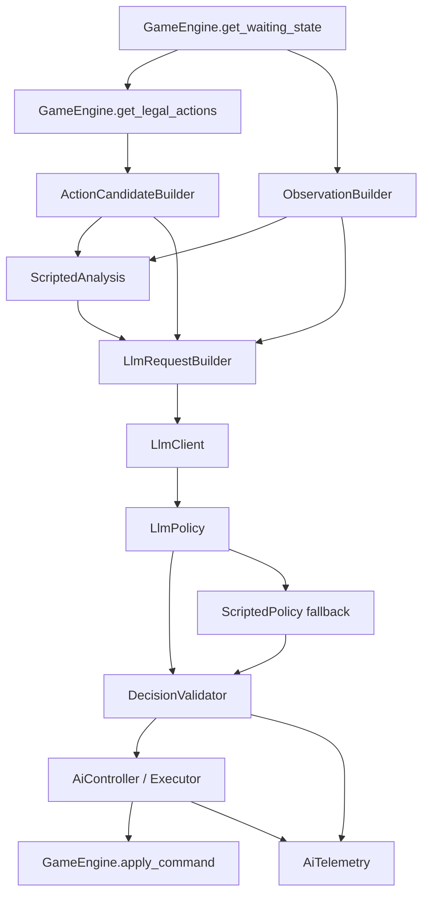

# 12 AI 整体开发方案

本文档作为后续 AI 开发的主文档，覆盖脚本 AI 与 LLM AI 两部分。目标是建立一套能长期跟随规则引擎、卡牌池和玩法扩展的 AI 架构：脚本 AI 负责稳定推进、低成本战术判断、回退和可审计旁注；LLM AI 负责在完整可见局面、完整合法候选、相关规则与卡牌文本的基础上做高强度决策。

核心原则：

1. 规则引擎是唯一规则权威。
2. AI 只从合法候选里选择，不自己拼非法命令。
3. LLM 看到原始可见信息和完整合法候选；脚本分析只作为旁注，不能替代原始信息。
4. 任意 AI 决策最终都必须经过本地校验和规则引擎执行。
5. 任意 LLM 异常都必须回退脚本 AI，不能卡死对局。

## 总目标

AI 系统分三个阶段成熟：

1. 能稳定跑完整局：脚本 AI 可以在 UI 和 headless 中完成自博弈。
2. 能接入 LLM：LLM 读取局面、候选、卡牌文本和规则提示，返回候选 ID，本地执行。
3. 能持续变强：通过候选表达、知识库、prompt、复盘 case 和评测数据迭代，而不是把策略塞进规则层。

最终理想形态：

```text
规则引擎给出合法动作
  -> AI 构建当前玩家可见 observation
  -> AI 构建完整候选 candidates
  -> 脚本 AI 生成客观战术事实和可反驳旁注
  -> LLM 读取全部信息并选择 candidate_id
  -> 本地校验 candidate_id 仍合法
  -> apply_command 执行
  -> telemetry 记录完整决策链路
```

## 非目标

1. 不让 LLM 接管规则合法性判断。
2. 不让脚本 AI 过滤掉 LLM 可见的合法候选。
3. 不把卡牌专属策略大量硬编码进 AI。
4. 不在第一阶段追求完整搜索、强化学习或人类级开局库。
5. 不在隐藏信息隔离测试完成前把 LLM 用于联机对局。

## 当前基础

现有工程已经具备 AI 接入的关键基础：

- 规则引擎提供 `get_waiting_state(state)`。
- 规则引擎提供 `get_legal_actions(state, player_id)`。
- 规则引擎通过 `apply_command(state, GameCommand)` 执行命令。
- `AiController` 已能驱动 UI 和 headless 对局。
- `ActionCandidateBuilder` 已能把部分 proposals 展开为可执行 payload。
- `ScriptedPolicyProfile` 已有画像、特征、评分、轻量模拟、veto 与日志摘要。
- `tools/run_ai_selfplay.gd` 已能跑脚本 AI 自博弈。

当前主要缺口：

- 缺少严格的 `ObservationBuilder`。
- 扁平候选缺少稳定 `candidate_id` 和给 LLM 阅读的完整描述。
- 缺少 LLM client、request builder、policy、decision validator。
- 缺少 LLM 决策日志、缓存和 fake client 测试。
- 隐藏信息隔离还没有作为测试契约固定下来。

## 架构总览



推荐目录：

```text
ai/
  core/
    action_candidate_builder.gd
    observation_builder.gd
    candidate_describer.gd
    tactical_fact_builder.gd
  runtime/
    ai_controller.gd
    ai_telemetry.gd
  scripted/
    scripted_policy_profile.gd
    scripted_policy_random.gd
    candidate_simulator.gd
    profile_feature_extractor.gd
    deck_profile_registry.gd
    opponent_profile_guesser.gd
  llm/
    llm_policy.gd
    llm_client.gd
    llm_request_builder.gd
    decision_validator.gd
    fake_llm_client.gd
data/
  ai/
    profiles.json
    llm_settings.example.json
    rule_knowledge.json
    llm_cases/
tests/
  unit/
    test_ai_observation_visibility.gd
    test_ai_candidate_builder.gd
    test_llm_policy_fallback.gd
    test_llm_decision_validator.gd
tools/
  run_ai_selfplay.gd
  run_llm_ai_smoke.gd
```

## 稳定接口契约

AI 长期只依赖以下规则引擎接口：

- `get_waiting_state(state)`
- `get_legal_actions(state, player_id)`
- `validate_command(state, command)`
- `apply_command(state, command)`

新增卡牌或规则时，优先保证规则引擎暴露正确合法动作，而不是让 AI 自己补规则推断。

Action proposal 推荐长期字段：

```json
{
  "proposal_id": "play_card:c_0007",
  "kind": "play_card",
  "command_type": "PlayCard",
  "label": "Play ...",
  "payload_template": {},
  "source": {},
  "targets": [],
  "target_mode": "slot",
  "play_kind": "board_or_artifact",
  "cost": {},
  "options": [],
  "candidate_card_ids": []
}
```

字段可以增加，但不要随意改变已有字段语义。若必须改变，增加 schema version。

## 候选 Candidate Schema

`ActionCandidateBuilder` 负责把 action proposals 扁平化为可执行候选。

候选必须包含：

```json
{
  "candidate_id": "cand_0012_a84f91",
  "proposal_id": "play_card:c_0007",
  "kind": "play_card",
  "command_type": "PlayCard",
  "payload": {},
  "source": {},
  "target": {},
  "description": "将 ... 登场到己方前排 2 号位",
  "cost_summary": "消耗 2 士气，手牌 -1",
  "risk_summary": "不交出优先权，仍保留行动窗口",
  "involved_card_ids": [],
  "tags": []
}
```

要求：

- `candidate_id` 在同一请求内唯一。
- LLM 只能返回 `candidate_id`。
- 本地执行时只使用 candidate 中保存的 `command_type + payload`。
- 不信任 LLM 生成的 payload。
- 所有合法候选默认都给 LLM，不因脚本评分低而删除。

候选描述优先使用原始事实：

- 动作类型。
- 来源卡牌。
- 目标卡牌或格子。
- 支付成本。
- 可能改变的公开资源。
- 是否会进入 stack / priority / choice。

避免在 `description` 中写主观结论，例如“这是最优攻击”。主观判断放到 heuristic 字段。

## Observation Schema

`ObservationBuilder` 负责构建当前玩家视角的局面。

推荐结构：

```json
{
  "schema_version": 1,
  "viewer_player_id": 0,
  "turn_number": 5,
  "phase": "main",
  "waiting_state": {},
  "self": {},
  "opponent": {},
  "battlefield": {},
  "stack": [],
  "pending_attack": {},
  "pending_choice": {},
  "recent_events": [],
  "profiles": {}
}
```

`self` 可包含：

- 主将名称、ID、生命、最大生命。
- 手牌完整卡牌信息。
- 牌库数量，不包含顺序。
- 墓地、费用区、神器区公开信息。
- 前后排单位和状态。
- 士气、计数器、公开 flags。

`opponent` 可包含：

- 主将名称、ID、生命、最大生命。
- 手牌数量，不包含内容。
- 牌库数量，不包含顺序。
- 墓地、费用区、神器区公开信息。
- 前后排单位和状态。
- 已公开行动摘要。

禁止包含：

- 对手手牌内容。
- 对手牌库顺序。
- 对手私密随机状态。
- 任何未公开 zone 的具体卡牌。
- debug/test 后门信息。

LLM 模式必须使用 observation，而不是直接序列化完整 `GameState`。

## 原始信息与脚本旁注原则

LLM 的强度来自综合原始信息，所以不能把脚本 AI 的判断变成信息瓶颈。

LLM 输入优先级：

1. 完整可见局面。
2. 完整合法候选。
3. 相关卡牌原始文本。
4. 相关规则原始摘要。
5. 脚本 AI 的客观战术事实。
6. 脚本 AI 的可反驳启发式旁注。

脚本 AI 可以生成：

```json
{
  "candidate_id": "cand_0012_a84f91",
  "objective_facts": [
    "self_hand_delta:-1",
    "enemy_front_delta:-1",
    "opens_master_lane:true"
  ],
  "heuristic_score": 2.4,
  "heuristic_notes": [
    "脚本认为该动作能清掉最后前排",
    "脚本认为该动作保留反击窗口"
  ],
  "warnings": [
    "脚本认为该攻击可能亏场面"
  ]
}
```

要求：

- `objective_facts` 尽量是可计算事实。
- `heuristic_score` 只能作为参考。
- `warnings` 不能禁止 LLM 选择。
- 除非候选已非法或会导致系统卡死，否则不要因为脚本判断差而移除候选。

## 脚本 AI 定位

脚本 AI 的长期定位：

1. 无 LLM 时的可用 AI。
2. LLM 超时或失败时的 fallback。
3. headless 自博弈与规则稳定性测试工具。
4. 为 LLM 生成客观战术事实与可反驳旁注。
5. 处理高频、强约束、低收益的窗口，例如简单 priority pass、部分 choice 和保底推进。

脚本 AI 不应该成为最终强度上限，也不应该成为 LLM 的信息过滤器。

## 脚本 AI 快速提升方向

以下优化性价比高，且能同时帮助 LLM。

### 1. 资源账本

为每个候选计算：

- 手牌变化。
- 士气变化。
- 己方前排/后排变化。
- 敌方前排/后排变化。
- 主将生命变化。
- 是否交出优先权。
- 是否进入低手牌、顶牌、无反击窗口。
- stack 是否产生未兑现收益。

输出给脚本评分，也输出给 LLM 作为 objective facts。

### 2. 显然战术 detector

优先实现：

- `lethal_available`：本回合可斩杀。
- `enemy_lethal_next_turn_risk`：下回合可能被斩杀。
- `opens_master_lane`：清掉最后前排。
- `projected_master_damage`：预计主将压力。
- `best_defense_cost`：最低资源防守方案。
- `bad_attack_no_payoff`：攻击亏场且无收益。
- `move_without_payoff`：移动消耗士气但没有站位/攻击收益。
- `response_window_guard_needed`：濒死响应窗口不能 pass。

这些 detector 应尽量返回事实，不直接删除候选。

### 3. Choice 智能

先补通用 choice 规则：

- 检索：优先拿当前可打、解场、斩杀、关键引擎、低费曲线。
- 弃牌：优先弃当前打不出、重复、低价值、与局面无关的牌。
- 排序：优先保留即将可用资源，底部放短期无用牌。
- option pick：优先选能立即兑现收益且不破坏保命资源的选项。

Choice 是脚本 AI 性价比很高的提升点，因为很多 choice 交给 LLM 会增加异步复杂度。

### 4. 轻量两步评估

只做固定模板，不做完整搜索：

- `MoveLegion -> DeclareAttack`
- `DeclareAttack -> 打开主将线`
- `ActivateEffect -> PlayCard`
- `ActivateEffect -> ActivateEffect`
- `PlayCard -> DeclareAttack`
- `ChooseDefense -> 下回合反打窗口`

每个模板只在 top-N 候选上运行，避免性能膨胀。

### 5. 卡牌 role/tag

给卡牌或效果增加通用标签：

- `removal`
- `draw`
- `search`
- `finisher`
- `counter`
- `guard`
- `engine`
- `grave_value`
- `tempo`
- `resource`
- `healing`
- `reposition`

这些标签可以由数据维护，也可以由导入工具从效果文本生成初稿。脚本 AI 用于估值，LLM 用于快速理解。

## 脚本 AI 不建议继续重投入的方向

以下方向成本高，且容易和 LLM 目标冲突：

- 给每张牌写专属策略代码。
- 大量硬编码卡组打法。
- 在脚本层做深度多步搜索。
- 因脚本评分低而隐藏候选。
- 把脚本结论当成 prompt 中唯一描述。

如果要做，应先确认 LLM 闭环已经完成，并证明该脚本逻辑能稳定提升 LLM 输入质量。

## LLM AI 定位

LLM AI 负责高层决策：

- 读取完整可见局面。
- 读取完整合法候选。
- 读取相关卡牌文本和规则摘要。
- 参考脚本 objective facts 和 heuristic notes。
- 选择一个 `candidate_id`。

LLM 不负责：

- 判断动作是否合法。
- 生成 payload。
- 修改规则结算。
- 读取隐藏信息。
- 绕过本地校验。

## LLM 接管范围

第一阶段：

- 只接管 `WaitingForAction`。
- 只在候选数大于等于 2 时调用。
- 主要处理主阶段多候选决策。
- `WaitingForPriority` 和 `WaitingForChoice` 默认脚本 AI 处理。

第二阶段：

- 开放部分 option pick choice。
- 开放非紧急防御选择。
- 开放 stack response 中的反击/响应取舍。

第三阶段：

- 联机可选开启，但必须完成隐藏信息和同步测试。
- 支持更复杂的 choice，如多选、排序、检索后放回。

## LLM Request Schema

推荐请求：

```json
{
  "task": "choose_one_candidate",
  "versions": {
    "observation_schema": 1,
    "candidate_schema": 1,
    "prompt": 1,
    "knowledge": 1
  },
  "observation": {},
  "candidates": [],
  "card_refs": [],
  "rule_refs": [],
  "script_analysis": [],
  "output_schema": {
    "candidate_id": "string",
    "confidence": "number",
    "brief_reason": "string"
  }
}
```

`card_refs` 应优先包含：

- 自己手牌。
- 场上所有公开卡。
- 墓地/神器/费用区相关卡。
- 候选 source 和 target 涉及卡。
- stack 或 pending choice 涉及卡。

如果总量不大，可以给完整文本，不必过度摘要。

`rule_refs` 应包含：

- 当前阶段规则。
- 当前 waiting state 规则。
- 攻击/防御/优先权/堆叠/士气等相关规则。
- 当前候选涉及的关键词规则。

## LLM Response Schema

模型必须只输出 JSON：

```json
{
  "candidate_id": "cand_0012_a84f91",
  "confidence": 0.72,
  "brief_reason": "清掉最后前排后形成主将压力，同时保留一张响应牌。"
}
```

可选字段：

```json
{
  "plan": "本回合先清路，下回合双路压主将。",
  "rejected": [
    {
      "candidate_id": "cand_0008_b92c10",
      "reason": "消耗士气但不能立即改变场面。"
    }
  ]
}
```

本地只使用 `candidate_id`。

## Prompt 原则

System prompt 应固定强调：

```text
你是《十二军团》的对局 AI。
你只能从 candidates 中选择一个 candidate_id。
不要创造动作，不要修改 payload，不要假设隐藏信息。
所有 candidates 都是规则引擎给出的合法动作。
脚本分析只是启发式旁注，不一定正确。
优先考虑避免立即败北、把握斩杀、扩大场面、保留关键资源、减少无收益消耗。
只输出 JSON。
```

Prompt 不应该让模型“相信脚本评分就是答案”。更好的写法是：

```text
script_analysis 是本地启发式分析，可能有帮助，但你应基于 observation、card_refs、rule_refs 和完整 candidates 独立判断。
```

## LLM 决策校验

`DecisionValidator` 需要检查：

1. 返回 JSON 可解析。
2. 存在 `candidate_id`。
3. candidate_id 在当前候选集合中。
4. 当前等待玩家未变化。
5. 当前 waiting_state 未过期。
6. 候选 payload 通过 `validate_command()`。
7. 执行前 candidate 仍来自本地候选，未使用 LLM 自造 payload。

任意失败都 fallback。

## 异步和超时

LLM 调用不能阻塞牌桌。

`AiController` 需要新增请求状态：

```text
IDLE
REQUESTING_LLM
LLM_DONE
VALIDATING
EXECUTING
FALLBACK_EXECUTING
```

请求发起时记录：

- player_id。
- waiting_state。
- state_signature。
- candidate_hash。
- start_ms。

响应回来后，如果 state_signature 或 candidate_hash 不匹配，丢弃响应或 fallback。

默认超时建议：

```json
{
  "timeout_ms": 3500,
  "max_retries": 0,
  "fallback_policy": "scripted_profile"
}
```

## 回退策略

必须回退的情况：

- LLM disabled。
- 当前窗口不允许 LLM。
- HTTP 失败。
- 超时。
- JSON 非法。
- candidate_id 缺失。
- candidate_id 不存在。
- 候选过期。
- validate 失败。
- 执行失败。

回退顺序：

1. `ScriptedPolicyProfile`。
2. 当前窗口的安全推进动作，如 `PassPriority` 或 `EndPhase`。
3. 第一个仍合法候选。

回退不能沉默，必须写 telemetry。

## Telemetry

每一步 AI 决策都建议记录 JSONL。

LLM 决策：

```json
{
  "event": "llm_decision",
  "turn_number": 5,
  "phase": "main",
  "player_id": 0,
  "waiting_state": "WaitingForAction",
  "candidate_count": 18,
  "candidate_hash": "9b1a...",
  "model": "configured_model",
  "elapsed_ms": 1280,
  "selected_candidate_id": "cand_0012_a84f91",
  "confidence": 0.72,
  "brief_reason": "...",
  "command_type": "DeclareAttack",
  "fallback": false
}
```

Fallback：

```json
{
  "event": "llm_fallback",
  "reason": "timeout",
  "elapsed_ms": 3500,
  "candidate_hash": "9b1a...",
  "fallback_command": "PlayCard"
}
```

脚本决策：

```json
{
  "event": "scripted_decision",
  "profile_id": "takamagahara_starter_tempo",
  "candidate_count": 12,
  "selected_kind": "declare_attack",
  "score": 3.4,
  "top_candidates": []
}
```

普通日志默认不保存完整 prompt。调试模式可保存完整 request/response。

## 可回放与缓存

LLM 不保证天然确定，因此区分两种模式。

普通游玩：

- 记录最终命令序列。
- 回放时按命令序列复现。

实验评测：

- 低温度。
- 使用 `observation_hash + candidate_hash + model + prompt_version + knowledge_version` 缓存。
- 缓存命中时不重新请求模型。

缓存格式：

```json
{
  "cache_key": "...",
  "response": {
    "candidate_id": "cand_0012_a84f91",
    "confidence": 0.72,
    "brief_reason": "..."
  }
}
```

## 与新卡和新规则的兼容策略

新增卡牌时理想流程：

```text
新增卡牌数据
  -> 规则引擎支持效果
  -> get_legal_actions 暴露合法动作
  -> CandidateBuilder 自动描述候选
  -> ObservationBuilder 暴露相关公开状态
  -> LLM 通过卡牌文本理解新牌
```

通常不需要改 AI 策略代码。

需要改 AI 的情况：

- 新增 waiting state。
- 新增 action kind。
- 新增 target_mode。
- 新增 choice 类型。
- 新增隐藏/公开信息边界。
- 新增全局关键词或规则术语，且 LLM 需要规则提示。

因此每次新增规则时，要同步检查：

- action proposal 是否完整。
- candidate 是否能展开。
- observation 是否暴露必要公开信息。
- visibility test 是否覆盖。
- rule_knowledge 是否需要新增条目。

## 测试体系

### 1. Observation 隐藏信息测试

新增 `test_ai_observation_visibility.gd`。

必须覆盖：

- 玩家 0 observation 不含玩家 1 手牌内容。
- 玩家 0 observation 不含玩家 1 牌库顺序。
- 玩家 0 能看到自己的手牌。
- 双方都能看到公开战场、墓地、费用区、神器区。
- pending attack 和 stack 中公开信息可见。
- choice 中 looked cards 只在规则允许时可见。

### 2. Candidate 测试

新增或扩展 `test_ai_candidate_builder.gd`。

必须覆盖：

- 每个候选有唯一 candidate_id。
- 每个候选能映射到 command_type + payload。
- target 展开不丢字段。
- choice 候选能表达 card pick、option pick、排序类 choice。
- 所有候选 payload 均可通过 validate 或对应窗口测试。

### 3. 脚本 AI 测试

继续保留：

- smoke 自博弈。
- profile feature 测试。
- candidate simulator 测试。
- 典型低级错误 case。

新增重点：

- 斩杀检测。
- 漏防检测。
- 资源账本。
- choice 智能。
- objective facts 输出稳定性。

### 4. LLM Policy 测试

用 fake client 覆盖：

- 正常返回 candidate_id。
- 超时。
- HTTP 失败。
- 非 JSON。
- JSON 缺 candidate_id。
- 返回不存在候选。
- 返回过期候选。
- validate 失败。

要求全部能 fallback 并继续推进。

### 5. Headless 验收

工具：

- `tools/run_ai_selfplay.gd`
- `tools/run_llm_ai_smoke.gd`

验收：

- 脚本 AI 自博弈 20 局无卡死。
- fake LLM 固定选择候选，10 局无卡死。
- fake LLM 随机失败，10 局无卡死且 fallback 记录正确。
- 真实 LLM hybrid 跑完若干局，记录胜率、耗时、fallback 率。

## 开发路线

### M0：候选契约整理

目标：

- 给扁平候选增加 `candidate_id`。
- 增加 description、cost_summary、risk_summary、involved_card_ids。
- 补 candidate builder 测试。

完成标准：

- 所有现有 action kind 都能生成 candidate。
- LLM 可以只靠 candidate_id 选动作。

### M1：ObservationBuilder

目标：

- 实现当前玩家可见 observation。
- 严格隐藏对手私密信息。
- 输出典型局面样例。

完成标准：

- 隐藏信息测试通过。
- LLM request 不直接依赖完整 GameState。

### M2：脚本 AI 旁注化

目标：

- 将脚本评分、特征、模拟结果整理成 script_analysis。
- 区分 objective facts、heuristic notes、warnings。
- 不再把脚本 warning 当作 LLM 候选过滤条件。

完成标准：

- LLM request 中包含脚本旁注。
- 所有合法候选仍可见。

### M3：脚本 AI 低成本增强

目标：

- 实现资源账本。
- 实现斩杀/漏防/开主将线 detector。
- 优化常见 choice。
- 保留 scripted fallback 强度。

完成标准：

- 自博弈质量改善。
- objective facts 对 LLM 有可读价值。

### M4：Fake LLM 闭环

目标：

- 实现 `LlmPolicy`、`FakeLlmClient`、`DecisionValidator`。
- 不接真实网络，先跑通完整选择与执行链。

完成标准：

- fake LLM 能驱动主阶段动作。
- fake LLM 错误能 fallback。

### M5：HTTP LLM 接入

目标：

- 实现 `LlmClient`。
- 配置 endpoint、model、timeout。
- 支持 JSON 请求/响应。

完成标准：

- 真实 LLM 能在主阶段选择 candidate_id。
- 失败可回退。
- telemetry 完整。

### M6：Prompt 与知识库

目标：

- 建立 `rule_knowledge.json`。
- 将相关卡牌文本和规则摘要放入 request。
- 建立 prompt version。

完成标准：

- LLM 不依赖脚本结论也能理解当前候选。
- 典型失败可通过 prompt/知识库迭代修正。

### M7：复盘 case 与评测

目标：

- 建立 `data/ai/llm_cases/`。
- 收集错过斩杀、漏防、白烧资源、过度防守等 case。
- 建立 scripted vs LLM-hybrid 评测。

完成标准：

- 每次优化能用固定 case 验证。
- 能比较 LLM 与脚本 AI 的质量差异。

### M8：扩展窗口

目标：

- 逐步开放 choice、priority、防御窗口。
- 每开放一类窗口先补 fake client 与 fallback 测试。

完成标准：

- 不牺牲稳定性。
- LLM 只在确实能提升质量的窗口接管。

## 第一阶段最小完成定义

满足以下条件，即可认为 AI 新架构第一阶段完成：

1. 脚本 AI 仍能稳定跑完整局。
2. 所有合法候选都有 candidate_id。
3. ObservationBuilder 不泄露隐藏信息。
4. LLM request 包含完整可见局面、完整合法候选、相关卡牌文本、规则提示和脚本旁注。
5. fake LLM 能完成选择并执行。
6. 任意 fake LLM 失败都能 fallback。
7. 真实 LLM 能接管主阶段多候选窗口。
8. 每次 AI 决策都有可审计日志。

## 长期优化原则

1. 优先优化信息表达，再优化 prompt，再优化脚本规则。
2. 优先给 LLM 原文和完整候选，不要过早摘要压缩。
3. 脚本 AI 的主观判断必须可被 LLM 反驳。
4. 新卡优先通过卡牌文本、规则知识和候选描述进入 LLM。
5. 每个强度问题都尽量沉淀成 case，而不是只凭感觉调权重。
6. 回退和稳定性永远优先于单步聪明。

## 推荐下一步

最建议立刻做的顺序：

1. `ActionCandidateBuilder` 增加 candidate_id 和候选描述。
2. 新增 `ObservationBuilder` 和隐藏信息测试。
3. 把脚本 AI 输出整理为 `script_analysis`，但不删候选。
4. 实现 fake LLM 闭环。
5. 接真实 LLM。
6. 用复盘日志开始调 prompt 和知识库。

这样既能保留脚本 AI 的稳定价值，又能尽快验证 LLM AI 的真正上限。
